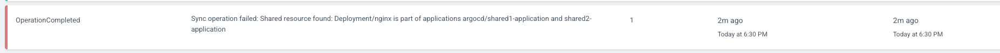

## Sync Policies
   

**Automated Sync**
 
Until now when we deployed an application we needed to sync it manually to create the resources.
 
Also when an application is already deployed and you modify the manifest of a deployment and push the changes, Argo will change it state to OutOfSync.
 
**Automated Sync** has the ability to automatically Sync an application when it detects differences between the desired manifest in git and the live state in the cluster.
 
One benefit is that the CI/CD pipelines no longer need direct access to the ArgoCD API Server to perform the deployment instead the pipeline make a commit and push to the git repository with the changes to the manifest in the tracking git repository.
 
**app-no-automated-sync.yaml**
    apiVersion: argoproj.io/v1alpha1
    kind: Application
    metadata:
      name: application-no-automated-sync
    spec:
      destination: # Where the application is deployed
        namespace: no-automated-sync
        server: https://kubernetes.default.svc
      project: default
      source:
        directory:
          recurse: true
        path: 03-argocd-applications/directoryofmanifests
        repoURL: https://github.com/rdumitru1/argocd-tutorial.git
        targetRevision: main

    kubectl create ns no-automated-sync
    kubectl create -f app-no-automated-sync.yaml

This application should be synced manually.
 
Change the replicas from 1 to 3 in **03-argocd-applications/directoryofmanifests/deployment.yaml** and refresh the application in UI and you will see that is OutOfSync and needs to be manually synced.

**automated-sync.yaml**
 
    apiVersion: argoproj.io/v1alpha1
    kind: Application
    metadata:
      name: automated-application
    spec:
      destination:
        namespace: automated-sync
        server: https://kubernetes.default.svc
      project: default
      source:
        path: v03-argocd-applications/directoryofmanifests
        repoURL: https://github.com/rdumitru1/argocd-tutorial.git
        targetRevision: main
      syncPolicy:           # This is a new directive
        automated: {}       # This means that this application is automated sync

    kubectl create ns automated-sync
    kubectl create -f automated-sync.yaml

If you go to the UI and verify, you will see that the application is automatically synced.
 
Change the replica back from 3 to 1 and go to UI refresh the app and see that the application is automatically synced.
 
If we delete a kubernetes manifest from git **03-argocd-applications/directoryofmanifests/service.yaml** and in the UI you refresh you will see that the application will be OutOfSync and a trash icon will appear on the service, if you synchronies the application you will see that the service will still be present.
 
In order to correctly synchronies the application when you click on sync check the **PRUNE** box as well and the Synchronize, and you will see that the service disappears.
 
The above **PRUNE** operation was done manually, now let's do this automatically.
 
First get back the deleted **03-argocd-applications/directoryofmanifests/service.yaml** file and in the UI hit a refresh to see that ArgoCD creates automatically the reverted **service.yaml** file.
 
**prune-sync.yml**

    apiVersion: argoproj.io/v1alpha1
    kind: Application
    metadata:
      name: prune-application
    spec:
      destination:
        namespace: prune-sync
        server: https://kubernetes.default.svc
      project: default
      source:
        path: v03-argocd-applications/directoryOfmanifests
        repoURL: https://github.com/devopshobbies/argocd-tutorial.git
        targetRevision: main
      syncPolicy:
        automated:
          prune: true     # This will automatically PRUNE the resources that gets deleted.
        
    kubectl create ns prune-sync
    kubectl create -f prune-sync.yml

If now we delete again the **03-argocd-applications/directoryofmanifests/service.yaml** file, in the UI we will see that the service resource will be automatically removed.
 
Get back the deleted **03-argocd-applications/directoryofmanifests/service.yaml** file and in the UI hit a refresh to see that ArgoCD creates automatically the reverted **service.yaml** file.
 
 
## Self Healing
   
If we scale the deployment to 10 pods for our **automated-application** (which has Automated Sync only but does not have Auto PRUNE or Auto Self Healing deployment) directly in the CLI, the number of pods will be 10 in the Kubernetes cluster but in the git repo there is only 1.
 
    kubectl scale deploy/nginx --replicas=10 -n automated-sync
    kubectl get deploy -n automated-sync
      NAME    READY   UP-TO-DATE   AVAILABLE   AGE
      nginx   10/10   10           10          144m

So there are difference between this 2 states, Target State and Live State.
 
Because of this difference the application in the UI will have 10 pods and it will become OutOfSync and needs to be manually synced to tell ArgoCD to detect the additional pods and terminate the additional pods. So Argo detects that the number of replicas in git is 1 and the number of pods in the live state is 10.
 
When I click on sync/synchronize, ArgoCD will terminate all additional pods.
 
I want ArgoCd to do this automatically.
 
**selfheal-sync.yaml**

    kubectl create ns selfheal-sync

    apiVersion: argoproj.io/v1alpha1
    kind: Application
    metadata:
      name: selfheal-application
    spec:
      destination:
        namespace: selfheal-sync
        server: https://kubernetes.default.svc
      project: default
      source:
        path: 03-argocd-applications/directoryofmanifests
        repoURL: https://github.com/rdumitru1/argocd-tutorial.git
        targetRevision: main
      syncPolicy:
        automated:
          selfHeal: true

Now if you scale again the application to 10 pods, ArgoCD will automatically correct the state of the application in the Kubernetes cluster and it will terminate all the additional pods.
 

    kubectl scale deploy/nginx --replicas=10 -n selfheal-sync
    kubectl get pods -n selfheal-sync

## Sync Options
 

Some of the Sync Options are used only in Application level, some of them are used on Resource level and some of them can be used in both of them.
 

**Resource Level**
Sync Options at resource level can be used as annotations.
 
1. no-prune
 

    metadata:
      annotations:
        argocd.argoproj.io/sync-options: Prune=false

I want to prevent a Service Account from being pruned.
 
In the **03-argocd-applications/directoryofmanifests/serviceaccount.yaml** file add **argocd.argoproj.io/sync-options: Prune=false** annotation.
 
**03-argocd-applications/directoryofmanifests/serviceaccount.yaml**

    apiVersion: v1
    kind: ServiceAccount
    metadata:
      name: nginx
      annotations:
        argocd.argoproj.io/sync-options: Prune=false      # This prevents the Service Account to be pruned.
      labels:
        helm.sh/chart: nginx-0.1.0
        app.kubernetes.io/name: nginx
        app.kubernetes.io/instance: nginx
        app.kubernetes.io/version: "1.16.0"
        app.kubernetes.io/managed-by: Helm

In this location **03-argocd-applications/directoryofmanifests** there are **service.yaml** which doesn't have the **Prune=false** annotation and **seviceaccount.yaml** which has the **Prune=false** annotation.
 
When both manifests **service.yaml** and **seviceaccount.yaml** will get deleted from the git repository and the application get refreshed, the Service will get pruned bi ArgoCD, but the Service Account will not be pruned by ArgoCD but it will have a trash icon.
 
1. Disable kubectl validation
 
**argocd.argoproj.io/sync-options: Validate=false**
 

    metadata:
      annotations:
        argocd.argoproj.io/sync-options: Validate=false

This Sync Option disables validation of kubectl.
 

**Application Level**
 
This Sync Option is used only in ArgoCD Application
 

1. Selective Sync
 
In ArgoCD when you manually sync an application or it gets automatically synced, ArgoCD doesn't sync only the resources that are OutOfSync it syncs all the resources.
 
Now I want to tell ArgoCD to sync only the OutOfSync resources.
 

    apiVersion: argoproj.io/v1alpha1
    kind: Application
    spec:
      syncPolicy
        syncOptions:
          ApplyOutOfSyncOnly=true

Modify the **06-argocd-sync-policies/sync-policies/automated-sync.yaml** file and add the Sync Option.
 

    apiVersion: argoproj.io/v1alpha1
    kind: Application
    metadata:
      name: automated-application
    spec:
      destination:
        namespace: automated-sync
        server: https://kubernetes.default.svc
      project: default
      source:
        path: 03-argocd-applications/directoryofmanifests
        repoURL: https://github.com/rdumitru1/argocd-tutorial.git
        targetRevision: main
      syncPolicy:
        syncOptions:
          - ApplyOutOfSyncOnly=true         # This enables selective sync
        automated: {}

In order for this to work, apply the modified file and make a change in the deployment **03-argocd-applications/directoryofmanifests/deployment.yaml**, change the replicas from 1 to 3.
 
After you refresh the application, check the **Last Sync** status in the UI and under **RESULT** you will see that only the deployment got synced.
 
2. FailOnSharedResource
 
By default ArgoCD will apply all manifests found in the git path configured in the application regardless if the resources defined in the yaml files are already applied by another application in the same namespace.
 
If the **FailOnSharedResource** Sync Option is set, ArgoCD will fail the Sync whenever it finds a resource in the current application that is applied already in the cluster by another application in the same namespace.
 
**shared1.yaml**

    apiVersion: argoproj.io/v1alpha1
    kind: Application
    metadata:
      name: shared1-application
    spec:
      destination:
        namespace: shared
        server: https://kubernetes.default.svc
      project: default
      source:
        path: 03-argocd-applications/directoryofmanifests
        repoURL: https://github.com/rdumitru1/argocd-tutorial.git
        targetRevision: main
      syncPolicy:
        automated: {}

**shared2.yaml**
 

    apiVersion: argoproj.io/v1alpha1
    kind: Application
    metadata:
      name: shared2-application
    spec:
      destination:
        namespace: shared
        server: https://kubernetes.default.svc
      project: default
      source:
        path: 03-argocd-applications/directoryofmanifests
        repoURL: https://github.com/rdumitru1/argocd-tutorial.git
        targetRevision: main
      syncPolicy:
        automated: {}

Deploy the application as they are, and then in the UI you will see that one of them is Synced ok and the second one is OutOfSync and with 3 Warnings.
 

    kubectl create ns shared
    kubectl apply -f shared1.yaml
    kubectl apply -f shared2.yaml

In order to fail the sync when you try to deploy the same resources in the same namespace modify the **shared1.yaml** and **shared2.yaml** files and apply the changes.
 
**shared1.yaml**

    apiVersion: argoproj.io/v1alpha1
    kind: Application
    metadata:
      name: shared1-application
    spec:
      destination:
        namespace: shared
        server: https://kubernetes.default.svc
      project: default
      source:
        path: 03-argocd-applications/directoryofmanifests
        repoURL: https://github.com/rdumitru1/argocd-tutorial.git
        targetRevision: main
      syncPolicy:
        syncOptions:
              - FailOnSharedResource=true
        automated: {}

**shared2.yaml**
 

    apiVersion: argoproj.io/v1alpha1
    kind: Application
    metadata:
      name: shared2-application
    spec:
      destination:
        namespace: shared
        server: https://kubernetes.default.svc
      project: default
      source:
        path: 03-argocd-applications/directoryofmanifests
        repoURL: https://github.com/rdumitru1/argocd-tutorial.git
        targetRevision: main
      syncPolicy:
        syncOptions:
          - FailOnSharedResource
        automated: {}

You will see that one application will have Sync OK and the other one will continue to Sync and fail at one point.
 
By clicking the application and going to events you will see:
 

3. CreateNamespace
 
I want to create the namespaces automatically before the application syncs.
 

**create-ns.yaml**
 

    apiVersion: argoproj.io/v1alpha1
    kind: Application
    metadata:
      name: create-ns-application
    spec:
      destination:
        namespace: create-ns
        server: https://kubernetes.default.svc
      project: default
      source:
        path: 03-argocd-applications/directoryofmanifests
        repoURL: https://github.com/rdumitru1/argocd-tutorial.git
        targetRevision: main
      syncPolicy:
        syncOptions:
          - CreateNamespace=true
        automated: {}

4. Namespace metadata
 
When you use **CreateNamespace** Sync Option you can use **managedNamespaceMetadata**.
 
ArgoCD will create the namespace and the labels as well.
 

    apiVersion: argoproj.io/v1alpha1
    kind: Application
    metadata:
      namespace: test
    spec:
      syncPolicy:
        managedNamespaceMetadata:
          labels: # The labels to set on the application namespace
            any: label
            you: like
          annotations: # The annotations to set on the application namespace
            the: same
            applies: for
            annotations: on-the-namespace
        syncOptions:
        - CreateNamespace=true
 
 

**Resource Level** and **Application Level**
 
1. replace Sync Option
 
By default ArgoCD executes kubectl apply operation to apply the configuration stored in git, in some cases kubectl apply is not suitable.
 
For example the resource spec might be to big and won't fit into **kubectl.kubernetes.io/last-applied-configuration\:**  annotation that is added by kubectl apply.
 
In this situation you might use **Replace\=true** sync option.
 
If we use the Sync Option at the Application level it means that AgoCD will use **kubectl replace** to all the resources related to this application, but if we use replace at the resource level ArgoCD will use **kubectl replace** only for that resource.
 
In this file **03-argocd-applications/directoryofmanifests/service.yaml** we are using **argocd.argoproj.io/sync-options\: Replace\=true** annotation which is applied at the resource level.
 
1. PruneLast
 
When I use this Sync Option at the Resource level I say that I want to prune this resource last.
 
When I use this at the Application level it means that if I have multiple applications this application will be pruned last.