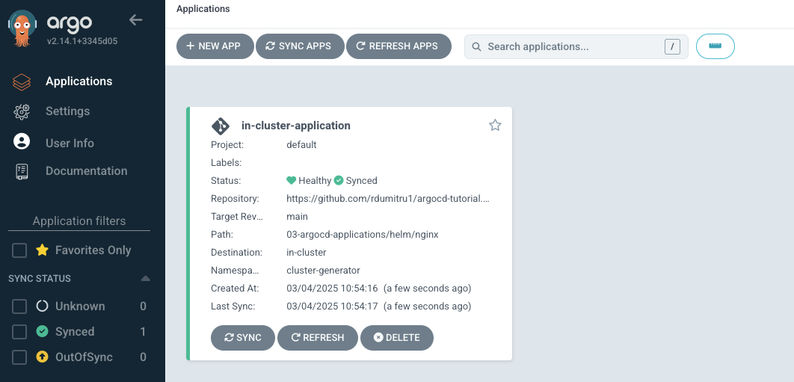
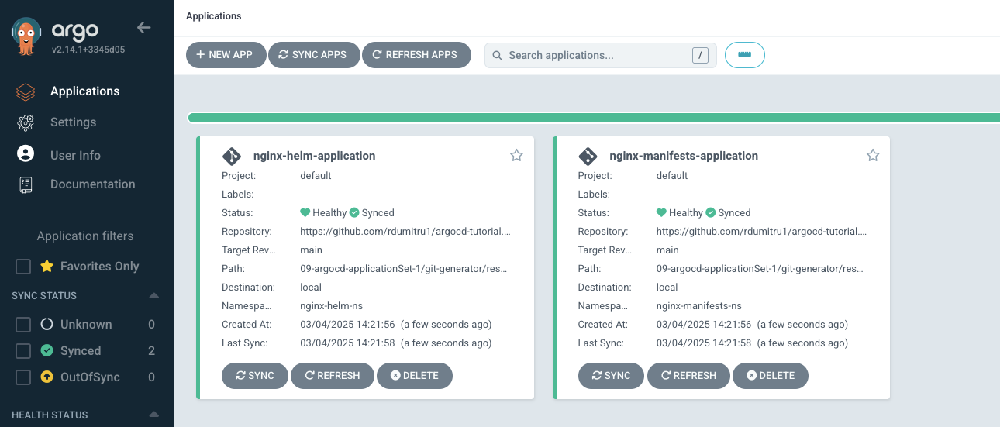
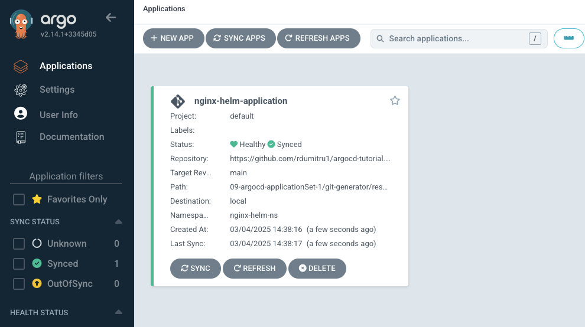

    kubectl get pods -n argocd
    NAME                                               READY   STATUS    RESTARTS       AGE
    argocd-application-controller-0                    1/1     Running   55 (10d ago)   23d
    argocd-applicationset-controller-b8948cbb4-htbxz   1/1     Running   3 (10d ago)    23d         # This is the applicationset controller
    argocd-dex-server-5cfd89f4c4-zhmgr                 1/1     Running   3 (10d ago)    23d
    argocd-notifications-controller-5b7946c7d8-wtk8t   1/1     Running   3 (10d ago)    23d
    argocd-redis-7c59b56464-28scd                      1/1     Running   3 (10d ago)    23d
    argocd-repo-server-77b8c4fb84-55bm6                1/1     Running   51 (10d ago)   23d
    argocd-server-bf56f7d5-k6hqf                       1/1     Running   41 (10d ago)   23d

The applicationset controller enables both automation and greater flexibility managing ArgoCD Applications across a large number of clusters.
 
The applicationset controller works alongside an existing ArgoCD installation.
 
Starting with ArgoCD version 2.3 the applicationset controller is bundled with ArgoCD.
 
Let's say that we have 3 different clusters in ArgoCD environment, cluster A, cluster B and cluster C.
 
To deploy an application on this 3 clusters we need to create 3 different manifest ArgoCD application files.
 

    apiVersion: argoproj.io/v1alpha1
    kind: Application
    metadata:
      name: new-cluster-application
      namespace: argocd
    spec:
      destination: # Where the application is deployed
        namespace: external
        name: in-cluster # In order to deploy on all 3 different clusters we need 3 different files with the **name** changed to point to all 3 clusters
      project: default
      source:
        path: 03-argocd-applications/directoryofmanifests
        repoURL: https://github.com/rdumitru1/argocd-tutorial.git
        targetRevision: main
      syncPolicy:
        syncOptions:
          - CreateNamespace=true
        automated: {}

The above solution is not ideal, if we had 10 clusters we would need 10 different files.
 
**applicationset** help us fix the problem of having multiple files, by just writing a single kubernetes manifest to generate multiple applications.
 
 

## Generators
 
I want applicationset to generate applications because of that we have multiple different generators in ArgoCD.
 
### List generator
 
List generator is responsible for generating parameters. Parameters are key value pairs that are substituted into the **template** section of the applicationset resource during template rendering.
 
**list-generator-ex1.yaml**
 

    apiVersion: argoproj.io/v1alpha1
    kind: ApplicationSet
    metadata:
      name: list-generator-ex1
      namespace: argocd
    spec:
      generators:
      - list:
          elements:
          - cluster: local                                   # first element in the list generator
            url: https://kubernetes.default.svc
            path: directoryofmanifests
          - cluster: external                                # second element in the list generator
            url: https://kubernetes.default.svc              # https://192.168.64.93:6443 I added https://kubernetes.default.svc because I don't have the second cluster configured.
            path: helm/nginx
      template:                                              # Under this block is the definition of an application 
        metadata:
          name: '{{cluster}}-application'                    # this will be **local-application** because of the first element and **external-application** because of the second element
        spec:
          project: default
          source:
            repoURL: https://github.com/rdumitru1/argocd-tutorial.git
            targetRevision: main
            path: 03-argocd-applications/{{path}}            # The {{path}} will take the value from the path key from the elements in the list generator.
          destination:
            server: '{{url}}'                                # The {{url}} will take the value from the path key from the elements in the list generator.
            namespace: '{{cluster}}'                         # The {{cluster}} will take the value from the path key from the elements in the list generator.
          syncPolicy:
            automated: {}
            syncOptions:
              - CreateNamespace=true

    kubectl apply -f list-generator-ex1.yaml

In the UI both application got deployed.
 

In the above example we are using 3 variables {{cluster}}, {{url}} and {{path}}.
 
The goal is generating applications so we are using a generator called **list**.
 
In the **list** generator we have 2 different elements, so we have 2 different applications.
 
### Cluster generator
 
Allows you to target ArgoCD applications to clusters based on the list of clusters defined within and managed by ArgoCD.
 
In ArgoCD managed clusters are stored within secrets in the ArgoCD namespace.
 
In the previous lecture we used a secret to add a new Kubernetes cluster to ArgoCD environment, applicationset controller uses those same secrets to generate parameters to identify and target available clusters.
 
For each cluster registered with ArgoCD the **Cluster Generator** produces parameters based on the list of items found within the cluster secret.
 
The cluster generator will provide some different parameters that we can use in applicationset manifest related to **Cluster Generator**.
 

**Parameters**
 

**name** - Is equal with stringData.secret from the secret
 

**namenormalized** - Normalize to contain only lowercase alpha numerical correctors. Also it will convert underline(_) to dash (-), test_a will become test-a
 

**server** - Is equal with stringData.server from the secret
 

**metadata.labels.<key>** Is equal with metadata.labels.<key>
 

**metadata.annotations.<key>** Is equal with metadata.annotations.<key>
 
Since I did not deployed the second cluster in a VM I can't follow this.
 

**cluster-generator-ex1.yaml**
 

    apiVersion: argoproj.io/v1alpha1
    kind: ApplicationSet
    metadata:
      name: cluster-generator-ex1
      namespace: argocd
    spec:
      generators:
      - clusters: {}
      template:
        metadata:
          name: '{{name}}-application'
        spec:
          project: "default"
          source:
            repoURL: https://github.com/devopshobbies/argocd-tutorial.git
            targetRevision: main
            path: v03-argocd-applications/helm/nginx
          destination:
            server: '{{server}}'
            namespace: cluster-generator
          syncPolicy:
            automated: {}
            syncOptions:
              - CreateNamespace=true

In the above file we have 2 variables **{{name}}** and **{{server}}**. This variables come from the output of **argocd cluster list**.
 

    argocd cluster list
    SERVER                          NAME        VERSION  STATUS      MESSAGE  PROJECT
    https://kubernetes.default.svc  in-cluster  1.27     Successful

If I would had multiple clusters it would look like this.
 

    argocd cluster list
    SERVER                          NAME        VERSION  STATUS      MESSAGE  PROJECT
    https://192.168.64.93:6443      external    1.27     Successful
    https://kubernetes.default.svc  in-cluster  1.27     Successful

The first variable is **{{name}}**, and name of the first cluster is **in-cluster** so the name of the first application will be **in-cluster-application** and the name of the second application will be **external-application**, if we would have 10 clusters we would had 10 different applications.
 

The second variable is **{{server}}**, where we are defining the server, we are defining the destination.
 
The server of the first application will be **https://kubernetes.default.svc** and the server for the second application will be **https://192.168.64.93:6443**.
 

    kubectl apply -f cluster-generator-ex1.yaml

Since I have a single kubernetes cluster I only have one application deployed.
 

 
Sometimes I want to deploy my application in some specific cluster in one or more specific clusters.
 

I want application A to be deployed in a cluster that has a specific label, in this situation we can use selectors in Cluster Generator to select some specific clusters for this purpose.
 

In the add a new cluster lecture we had used the **08-argocd-add-cluster/add-cluster/add-cluster-manifest/add-cluster-secret.yaml** secret, modify it and add the **environment: staging** label
 

    apiVersion: v1
    kind: Secret
    metadata:
      name: external
      labels:
        argocd.argoproj.io/secret-type: cluster       # This is important, it is saying that it is a secret of type cluster.
        environment: staging                          # This label will be used to target the external kubernetes cluster.
    type: Opaque
    stringData:
      name: external                                  # This can be anything, it represents the NAME field in the output of argocd cluster list
      server: API_SERVER_ADDRESS                      # This is the API_SERVER_ADDRESS of our new cluster. This is the server: https://ip_address:6443 from ~/.kube/config. Change it accordingly.
      config: |                                       # config
        {
          "bearerToken": "SERVICE_ACCOUNT_TOKEN",     # The generated token for the service account
          "tlsClientConfig": {
            "insecure": false,
            "caData": "BASE64 ENCODED CERTIFICATE"    # The certificate of our new kubernetes cluster. It needs to be base64 encoded.
          }
        }

 

**cluster-generator-ex2.yaml**
 

    apiVersion: argoproj.io/v1alpha1
    kind: ApplicationSet
    metadata:
      name: cluster-generator-ex2
      namespace: argocd
    spec:
      generators:
      - clusters:
          selector:
            matchLabels:                                    # I want my application to be deployed in a cluster that has this 2 labels. This are the labels from the secret 08-argocd-add-cluster/add-cluster/add-cluster-manifest/add-cluster-secret.yaml **metadata.labels**
              argocd.argoproj.io/secret-type: cluster
              environment: staging
      template:
        metadata:
          name: '{{name}}-application'
        spec:
          project: "default"
          source:
            repoURL: https://github.com/rdumitru1/argocd-tutorial.git
            targetRevision: main
            path: 03-argocd-applications/helm/nginx
          destination:
            server: '{{server}}'
            namespace: cluster-generator
          syncPolicy:
            automated: {}
            syncOptions:
              - CreateNamespace=true

I can't deploy **cluster-generator-ex2.yaml** because I did not created a VM with a new kubernetes cluster.
 
This **cluster-generator-ex2.yaml** file only targets the external cluster not the local cluster.
 

At this moment you can't target the local cluster because the local cluster does not have a secret, so the **cluster-generator-ex2.yaml** file only applies to external clusters.
 
In order to target the local cluster as well you will need to create a secret for it as well.
 

**09-argocd-applicationSet-1/local-cluster-secret.yaml**
 

    apiVersion: v1
    kind: Secret
    metadata:
      name: local
      labels:
        argocd.argoproj.io/secret-type: cluster
        environment: pre-staging                      # Based on this label you can target the local cluster
    type: Opaque
    stringData:
      name: local                                     # This can be anything, it represents the NAME field in the output of argocd cluster list
      server: https://kubernetes.default.svc          # This is https://kubernetes.default.svc because it refers to the local cluster.
      config: |                                       # config
        {
          "tlsClientConfig": {
            "insecure": false
          }
        }

Applying the above file it creates a secret for the local cluster as well.
 
Before applying the secret for the local cluster.
 

    argocd cluster list
    SERVER                          NAME        VERSION  STATUS      MESSAGE  PROJECT
    https://kubernetes.default.svc  in-cluster  1.27     Successful

    kubectl apply -f local-cluster-secret.yaml

After applying the secret for the local cluster.
 

    argocd cluster list
    SERVER                          NAME   VERSION  STATUS      MESSAGE  PROJECT
    https://kubernetes.default.svc  local  1.27     Successful

The **NAME** was changed from **in-cluster** to **local** because of **stingData.name**. At this moment the local cluster has a secret as well and we can target local cluster using **spec.generators.-clusters-selector.matchLabels** to match a label that was set in the secret for the local cluster.
 
 

We can pass additional string key value pairs via the **values** field of the cluster generator.
 

Values added via the **values** field are added as **values.something**
 

**09-argocd-applicationSet-1/cluster-generator/cluster-generator-ex3.yaml**

    apiVersion: argoproj.io/v1alpha1
    kind: ApplicationSet
    metadata:
      name: cluster-generator-ex3
      namespace: argocd
    spec:
      generators:
      - clusters:
          selector:
            matchLabels:
              environment: staging                                      # This targets the external cluster because the secret was created with this **environment: staging** label.
          values:
            path: helm/nginx
            namespace: staging-ns
      - clusters:
          selector:
            matchLabels:
              environment: pre-staging                                # This targets the local cluster because the secret was created with this **environment: pre-staging** label.
          values:
            path: directoryOfmanifests
            namespace: pre-staging-ns
      template:
        metadata:
          name: '{{name}}-application'
        spec:
          project: "default"
          source:
            repoURL: https://github.com/rdumitru1/argocd-tutorial.git
            targetRevision: main
            path: 03-argocd-applications/{{values.path}}
          destination:
            server: '{{server}}'
            namespace: '{{values.namespace}}'
          syncPolicy:
            automated: {}
            syncOptions:
              - CreateNamespace=true

 

    kubectl delete -f cluster-generator-ex1.yaml
    kubectl create -f cluster-generator-ex3.yaml

Since I only have the local cluster it will create only the application for the local cluster.
 

### Git Generator
I want application A to use **09-argocd-applicationSet-1/git-generator/resources/nginx-helm** as it's source and I want application B to use **09-argocd-applicationSet-1/git-generator/resources/nginx-manifests** as it's source.
 
The first solution is to create 2 different applications.
 

So application A will use **09-argocd-applicationSet-1/git-generator/resources/nginx-helm** as it source and application B will use **09-argocd-applicationSet-1/git-generator/resources/nginx-manifests** as it's source and that way will have 2 different applications, but it is not ideal.
 

The recommendation is to use **Git Generator** to create a single kubernetes manifest and generate multiple applications based on the directories that we have in this path **/Users/rdumitru/Learning/argocd/argocd1/09-argocd-applicationSet-1/git-generator/resources**.
 

**09-argocd-applicationSet-1/git-generator/directories-subtype/git-generator-ex1.yaml**
 
 

There are 2 subtypes in **Git Generator**, **directory** and **file**.
 
 
 

**directory subtype**
 

    apiVersion: argoproj.io/v1alpha1
    kind: ApplicationSet
    metadata:
      name: git-directories-generator-ex1
      namespace: argocd
    spec:
      generators:
      - git:
          repoURL: https://github.com/rdumitru1/argocd-tutorial.git
          revision: main
          directories:
          - path: 09-argocd-applicationSet-1/git-generator/resources/*    # Because the path have 2 folders **nginx-helm** and **nginx-manifests** it will create 2 applications.
      template:
        metadata:
          name: '{{path.basename}}-application'                           # This will be **nginx-manifests-application** and **nginx-helm-application**
        spec:
          project: default
          source:
            repoURL: https://github.com/rdumitru1/argocd-tutorial.git
            targetRevision: main
            path: '{{path}}'                          
          destination:
            server: https://kubernetes.default.svc                       # The server on which the applications will be deployed.
            namespace: '{{path.basename}}-ns'                            # this will be *nginx-manifests-ns** and **nginx-helm-ns**
          syncPolicy:
            automated: {}
            syncOptions:
              - CreateNamespace=true

**09-argocd-applicationSet-1/git-generator/resources/** have 2 folders **nginx-helm** and **nginx-manifests**.
 
The Git Generator will automatically provide us some different parameters.
 
The first parameter is **path**.
 

The path of the first application will be **09-argocd-applicationSet-1/git-generator/resources/nginx-manifests**, this is the value related to a key called **path**..
The path of the second application will be **09-argocd-applicationSet-1/git-generator/resources/nginx-helm**, this is the value related to a key called **path**.
 

The second parameter is **path.basename**.
 

The **path.basename** is the most right path name, so the **path.basename** of **09-argocd-applicationSet-1/git-generator/resources/nginx-manifests** is **nginx-manifests**, and the **path.basename** of **09-argocd-applicationSet-1/git-generator/resources/nginx-helm** is **nginx-helm**.
 

The name of the applications will be **nginx-manifests-application** and **nginx-helm-application**
 

    kubectl apply -f git-generator-ex1.yaml

 

**09-argocd-applicationSet-1/git-generator/directories-subtype/git-generator-ex2.yaml**
 

    apiVersion: argoproj.io/v1alpha1
    kind: ApplicationSet
    metadata:
      name: git-directories-generator-ex2
      namespace: argocd
    spec:
      generators:
      - git:
          repoURL: https://github.com/rdumitru1/argocd-tutorial.git
          revision: main
          directories:                                                       # Here we are using 2 different paths but I want to exclude one or more specific paths of the first path.
          - path: 09-argocd-applicationSet-1/git-generator/resources/*
          - path: 09-argocd-applicationSet-1/git-generator/resources/nginx-manifests
            exclude: true                                                    # This will exclude the **09-argocd-applicationSet-1/git-generator/resources/nginx-manifests** path
      template:
        metadata:
          name: '{{path.basename}}-application'
        spec:
          project: default
          source:
            repoURL: https://github.com/rdumitru1/argocd-tutorial.git
            targetRevision: main
            path: '{{path}}'
          destination:
            server: https://kubernetes.default.svc
            namespace: '{{path.basename}}-ns'
          syncPolicy:
            automated: {}
            syncOptions:
              - CreateNamespace=true

In the above example we are using 2 different path, but I want to exclude one or more specific paths of the first path.
 

    kubectl delete -f git-generator-ex1.yaml
    kubectl create -f git-generator-ex2.yaml

 
 
 

**git file generator**
 

The git file is the second subtype of the **Git Generator**. The git file subtype generates parameters using the contents of json or yaml file found within a specified repository.
 

**09-argocd-applicationSet-1/git-generator/files-subtype/git-generator-ex1.yaml**
 

    apiVersion: argoproj.io/v1alpha1
    kind: ApplicationSet
    metadata:
      name: git-files-generator-ex1
      namespace: argocd
    spec:
      generators:
      - git:
          repoURL: https://github.com/rdumitru1/argocd-tutorial.git
          revision: main
          files:                                                                          # We are using **files** instead of **directories**
          - path: 09-argocd-applicationSet-1/git-generator/cluster-config/**/config.json
      template:
        metadata:
          name: '{{cluster.name}}-application'
        spec:
          project: default
          source:
            repoURL: https://github.com/rdumitru1/argocd-tutorial.git
            targetRevision: main
            path: '{{cluster.path}}'
          destination:
            server: '{{cluster.address}}'
            namespace: '{{cluster.namespace}}'
          syncPolicy:
            automated: {}
            syncOptions:
              - CreateNamespace=true

We have a path **09-argocd-applicationSet-1/git-generator/cluster-config/**/config.json** which translates to **09-argocd-applicationSet-1/git-generator/cluster-config/staging/config.json** and **09-argocd-applicationSet-1/git-generator/cluster-config/pre-staging/config.json**.
 

In file **09-argocd-applicationSet-1/git-generator/cluster-config/staging/config.json** is the configuration for new cluster.
 

    {
      "cluster": {
        "owner": "dmr",
        "name": "staging",
        "path": "03-argocd-applications/helm/nginx",
        "source_type": "helm", 
        "address": "https://192.168.226.93:6443",
        "namespace": "staging-ns"
      }
    }

In file **09-argocd-applicationSet-1/git-generator/cluster-config/pre-staging/config.json** is the configuration of the local cluster.
 

    {
      "cluster": {
        "owner": "dmr",
        "name": "pre-staging",
        "path": "03-argocd-applications/directoryOfmanifests",
        "source_type": "directoryOfManifests",
        "address": "https://kubernetes.default.svc",
        "namespace": "pre-staging-ns"
      }
    }

So we are using **09-argocd-applicationSet-1/git-generator/cluster-config/**/config.json** to extract all the files, all the config.json files related to **09-argocd-applicationSet-1/git-generator/cluster-config/\*\***.
 

We are using different parameters like, **{{cluster.name}}**, **{{cluster.path}}**, **{{cluster.address}}**, and **{{cluster.namespace}}**.
 

The content of **config.json** are parsed and converted into template parameters like this.
 

    {
      "cluster": {
        "owner": "dmr",
        "name": "pre-staging",
        "path": "03-argocd-applications/directoryofmanifests",
        "source_type": "directoryofManifests",
        "address": "https://kubernetes.default.svc",
        "namespace": "pre-staging-ns"
      }
    }

    {
      "cluster": {
        "cluster.owner": "dmr",
        "cluster.name": "pre-staging",
        "cluster.path": "03-argocd-applications/directoryofmanifests",
        "cluster.source_type": "directoryofManifests",
        "cluster.address": "https://kubernetes.default.svc",
        "cluster.namespace": "pre-staging-ns"
      }
    }