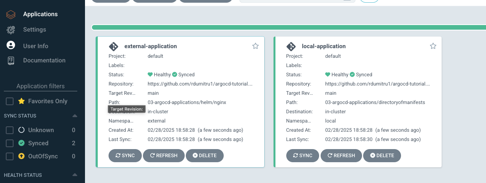

    kubectl get pods -n argocd
    NAME                                               READY   STATUS    RESTARTS       AGE
    argocd-application-controller-0                    1/1     Running   55 (10d ago)   23d
    argocd-applicationset-controller-b8948cbb4-htbxz   1/1     Running   3 (10d ago)    23d         # This is the applicationset controller
    argocd-dex-server-5cfd89f4c4-zhmgr                 1/1     Running   3 (10d ago)    23d
    argocd-notifications-controller-5b7946c7d8-wtk8t   1/1     Running   3 (10d ago)    23d
    argocd-redis-7c59b56464-28scd                      1/1     Running   3 (10d ago)    23d
    argocd-repo-server-77b8c4fb84-55bm6                1/1     Running   51 (10d ago)   23d
    argocd-server-bf56f7d5-k6hqf                       1/1     Running   41 (10d ago)   23d

The applicationset controller enables both automation and greater flexibility managing ArgoCD Applications across a large number of clusters.
 
The applicationset controller works alongside an existing ArgoCD installation.
 
Starting with ArgoCD version 2.3 the applicationset controller is bundled with ArgoCD.
 
Let's say that we have 3 different clusters in ArgoCD environment, cluster A, cluster B and cluster C.
 
To deploy an application on this 3 clusters we need to create 3 different manifest ArgoCD application files.
 

    apiVersion: argoproj.io/v1alpha1
    kind: Application
    metadata:
      name: new-cluster-application
      namespace: argocd
    spec:
      destination: # Where the application is deployed
        namespace: external
        name: in-cluster # In order to deploy on all 3 different clusters we need 3 different files with the **name** changed to point to all 3 clusters
      project: default
      source:
        path: 03-argocd-applications/directoryofmanifests
        repoURL: https://github.com/rdumitru1/argocd-tutorial.git
        targetRevision: main
      syncPolicy:
        syncOptions:
          - CreateNamespace=true
        automated: {}

The above solution is not ideal, if we had 10 clusters we would need 10 different files.
 
**applicationset** help us fix the problem of having multiple files, by just writing a single kubernetes manifest to generate multiple applications.
 
 

## Generators
 
I want applicationset to generate applications because of that we have multiple different generators in ArgoCD.
 
### List generator
 
List generator is responsible for generating parameters. Parameters are key value pairs that are substituted into the **template** section of the applicationset resource during template rendering.
 
**list-generator-ex1.yaml**
 

    apiVersion: argoproj.io/v1alpha1
    kind: ApplicationSet
    metadata:
      name: list-generator-ex1
      namespace: argocd
    spec:
      generators:
      - list:
          elements:
          - cluster: local                                   # first element in the list generator
            url: https://kubernetes.default.svc
            path: directoryofmanifests
          - cluster: external                                # second element in the list generator
            url: https://kubernetes.default.svc              # https://192.168.64.93:6443 I added https://kubernetes.default.svc because I don't have the second cluster configured.
            path: helm/nginx
      template:                                              # Under this block is the definition of an application 
        metadata:
          name: '{{cluster}}-application'                    # this will be **local-application** because of the first element and **external-application** because of the second element
        spec:
          project: default
          source:
            repoURL: https://github.com/rdumitru1/argocd-tutorial.git
            targetRevision: main
            path: 03-argocd-applications/{{path}}            # The {{path}} will take the value from the path key from the elements in the list generator.
          destination:
            server: '{{url}}'                                # The {{url}} will take the value from the path key from the elements in the list generator.
            namespace: '{{cluster}}'                         # The {{cluster}} will take the value from the path key from the elements in the list generator.
          syncPolicy:
            automated: {}
            syncOptions:
              - CreateNamespace=true

    kubectl apply -f list-generator-ex1.yaml

In the UI both application got deployed.
 

In the above example we are using 3 variables {{cluster}}, {{url}} and {{path}}.
 
The goal is generating applications so we are using a generator called **list**.
 
In the **list** generator we have 2 different elements, so we have 2 different applications.