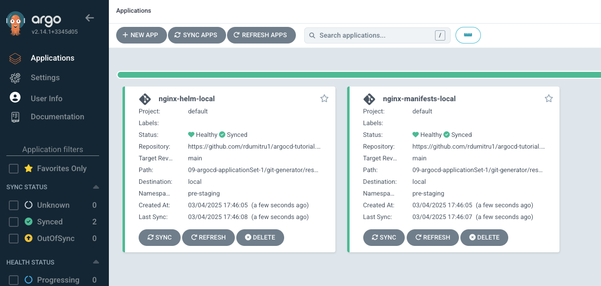

### Matrix Generator
 

**Matrix Generator** combines the parameters generated by 2 child generators iterating through every combination of each generators generated parameters. By combining both generators parameters to produce every possible combination, this allows you to gain the intrinsic properties of both generators.
 

Lets imagine that we have 2 different types of resources in our git repository. First resource type is Jenkins and second type is Prometheus operator.
 

And also I should have 2 different kubernetes clusters, **local-cluster** and **external-cluster**, bu in this case I only have the **local-cluster**.
 
The goal is to deploy both applications onto both clusters.
 
I want Jenkins and Prometheus operator to be deployed in the **local-cluster** as well as in **external-cluster**.
 
For this we will need 4 different applications in ArgoCD, jenkins-in-local-cluster, jenkins-in-external-cluster, prometheus-in-local-cluster and prometheus-in-external-cluster.
 

For this we will use the **Matrix Generator** with the **Git** and **Cluster** as child Generators.
 

**10-argocd-applicationSet-2/matrix-generator/matrix-generator-ex1.yaml**
 

    apiVersion: argoproj.io/v1alpha1
    kind: ApplicationSet
    metadata:
      name: matrix-generator-ex1
      namespace: argocd
    spec:
      generators:
        - matrix:
            generators:
              - git:
                  repoURL: https://github.com/rdumitru1/argocd-tutorial.git
                  revision: main
                  directories:
                    - path: 09-argocd-applicationSet-1/git-generator/resources/*
              - clusters: {}
      template:
        metadata:
          name: '{{path.basename}}-{{name}}'    # **{{path.basename}}** is a parameter from **Git Generator**, **{{name}}** is a parameter from **Cluster Generator**.
        spec:
          project: default
          source:
            repoURL: https://github.com/rdumitru1/argocd-tutorial.git
            targetRevision: main
            path: '{{path}}'                    # **{{path}}** is a parameter from **Git Generator**
          destination:
            server: '{{server}}'                # **{{server}}** is a parameter from **Cluster Generator**.
            namespace: '{{metadata.labels.environment}}'    # {{metadata.labels.environment}} is a parameter from **Cluster Generator**.
          syncPolicy:
            automated: {}
            syncOptions:
              - CreateNamespace=true

    kubectl apply -f matrix-generator-ex1.yaml

 

Since I only have the local cluster it only created the **nginx-helm-local** and **nginx-manifests-local**, if the external cluster existed I should see **nginx-helm-external** and **nginx-manifests-external** as well.