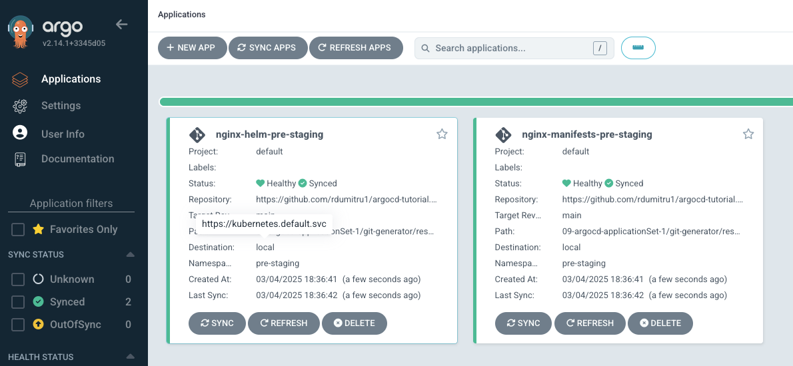
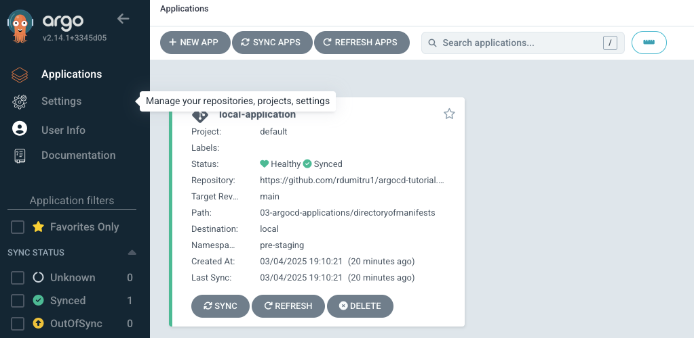
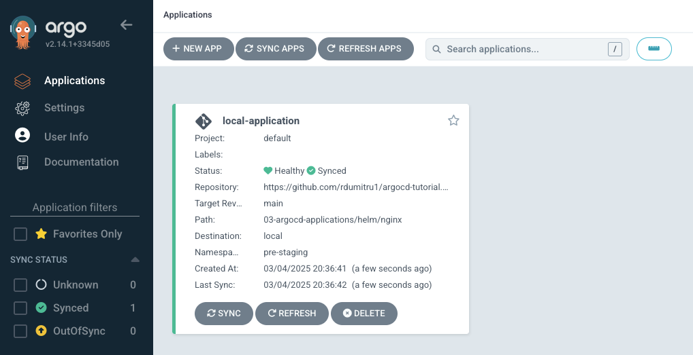

### Matrix Generator
 

**Matrix Generator** combines the parameters generated by 2 child generators iterating through every combination of each generators generated parameters. By combining both generators parameters to produce every possible combination, this allows you to gain the intrinsic properties of both generators.
 

Lets imagine that we have 2 different types of resources in our git repository. First resource type is Jenkins and second type is Prometheus operator.
 

And also I should have 2 different kubernetes clusters, **local-cluster** and **external-cluster**, bu in this case I only have the **local-cluster**.
 
The goal is to deploy both applications onto both clusters.
 
I want Jenkins and Prometheus operator to be deployed in the **local-cluster** as well as in **external-cluster**.
 
For this we will need 4 different applications in ArgoCD, jenkins-in-local-cluster, jenkins-in-external-cluster, prometheus-in-local-cluster and prometheus-in-external-cluster.
 

For this we will use the **Matrix Generator** with the **Git** and **Cluster** as child Generators.
 

**10-argocd-applicationSet-2/matrix-generator/matrix-generator-ex1.yaml**
 

    apiVersion: argoproj.io/v1alpha1
    kind: ApplicationSet
    metadata:
      name: matrix-generator-ex1
      namespace: argocd
    spec:
      generators:
        - matrix:
            generators:
              - git:
                  repoURL: https://github.com/rdumitru1/argocd-tutorial.git
                  revision: main
                  directories:
                    - path: 09-argocd-applicationSet-1/git-generator/resources/*
              - clusters: {}
      template:
        metadata:
          name: '{{path.basename}}-{{name}}'    # **{{path.basename}}** is a parameter from **Git Generator**, **{{name}}** is a parameter from **Cluster Generator**.
        spec:
          project: default
          source:
            repoURL: https://github.com/rdumitru1/argocd-tutorial.git
            targetRevision: main
            path: '{{path}}'                    # **{{path}}** is a parameter from **Git Generator**
          destination:
            server: '{{server}}'                # **{{server}}** is a parameter from **Cluster Generator**.
            namespace: '{{metadata.labels.environment}}'    # {{metadata.labels.environment}} is a parameter from **Cluster Generator**.
          syncPolicy:
            automated: {}
            syncOptions:
              - CreateNamespace=true

    kubectl apply -f matrix-generator-ex1.yaml

**{{metadata.labels.environment}}** comes from the secrets that we created for the local and external clusters. **(metadata.labels.environment)**
 

 

Since I only have the local cluster it only created the **nginx-helm-local** and **nginx-manifests-local**, if the external cluster existed I should see **nginx-helm-external** and **nginx-manifests-external** as well.
 
Now lets remove **cluster{}** and replace it with **list**.
 

    apiVersion: argoproj.io/v1alpha1
    kind: ApplicationSet
    metadata:
      name: matrix-generator-ex2
    spec:
      generators:
        - matrix:
            generators:
              - git:
                  repoURL: https://github.com/rdumitru1/argocd-tutorial.git
                  revision: main
                  directories:
                    - path: 09-argocd-applicationSet-1/git-generator/resources/*
              - list:
                  elements:
                  - environment: pre-staging
                    server: https://kubernetes.default.svc
                  - environment: staging
                    server: https://192.168.226.93:6443         # This does not exist
      template:
        metadata:
          name: '{{path.basename}}-{{environment}}'
        spec:
          project: default
          source:
            repoURL: https://github.com/rdumitru1/argocd-tutorial.git
            targetRevision: main
            path: '{{path}}'
          destination:
            server: '{{server}}'                                # This refers to the **server** parameter from the list child Generator.
            namespace: '{{environment}}'
          syncPolicy:
            automated: {}
            syncOptions:
              - CreateNamespace=true

    kubectl apply -f matrix-generator-ex2.yaml

 
Again since I only have the local cluster only 2 applications are deployed.
 

Let's imagine that we have 2 different types of resources in our git repository:
 

**PATH-1**: 03-argocd-applications/directoryofmanifests
I want to deploy this resource into a cluster if it has a label called **environment: prestaging**
 

**PATH-2**: 03-argocd-applications/helm/nginx
I want to deploy this resource into a cluster if it has a label called **environment: staging**
 

**10-argocd-applicationSet-2/matrix-generator/matrix-generator-ex3.yaml**
 

apiVersion: argoproj.io/v1alpha1
kind: ApplicationSet
metadata:
  name: matrix-generator-ex3
spec:
  generators:
    - matrix:
        generators:
          - git:
              repoURL: https://github.com/rdumitru1/argocd-tutorial.git
              revision: main
              files:
                - path: 09-argocd-applicationSet-1/git-generator/cluster-config/**/config.json
          - clusters:
              selector:
                matchLabels:
                  argocd.argoproj.io/secret-type: cluster
                  environment: '{{cluster.name}}'   # **{{cluster.name}}** is a parameter defined in **config.json** in the Git child generator
  template:
    metadata:
      name: '{{name}}-application'
    spec:
      project: default
      source:
        repoURL: https://github.com/rdumitru1/argocd-tutorial.git
        targetRevision: main
        path: '{{cluster.path}}'
      destination:
        server: '{{server}}'
        namespace: '{{metadata.labels.environment}}'
      syncPolicy:
        automated: {}
        syncOptions:
          - CreateNamespace=true

The **Matrix Generator** allows using the parameters generated by 1 child generator inside another child generator.
 

    kubectl apply -f matrix-generator-ex3.yaml

 
I see only one app because I don't have configured the second cluster.
 

### Merge Generator
 

The Merge Generator combines parameters produced by the base or first generator with matching parameters sets produced by subsequent generators.
 

Using a Merge Generator is appropriate when a subset of parameters sets require overwriting.
 

Lets image that we have the helm chart of an application called nginx.
 

**10-argocd-applicationSet-2/merge-generator/merge-generator-ex1.yaml**
 

    apiVersion: argoproj.io/v1alpha1
    kind: ApplicationSet
    metadata:
      name: merge-generator-ex1
    spec:
      generators:
        - merge:                                                # Parent Generator
            mergeKeys:                                          # Parameter used in the code to combine the output multiple generators into a single set of values.
              - server
            generators:
              - clusters:                                       # **BASE Cluster Generator**
                  values:
                    tag: '1.23'
                    replicas: '1'
              - clusters:                                       # **Override Cluster Generator**
                  selector:
                    matchLabels:
                      environment: 'staging'                    # Overrides the tag only for the cluster with a label set to **environment: 'staging'**. This applies to external cluster
                  values:
                    tag: '1.24'                                 # This overrides the tag from the **BASE Cluster Generator**
              - list:                                           # **List Generator**
                  elements: 
                    - server: https://kubernetes.default.svc    # The bellow applies only to this cluster
                      values.replicas: '3'                      # Overrides the number of replicas from 1 to 3 for this cluster https://kubernetes.default.svc
      template:
        metadata:
          name: '{{name}}-application'
        spec:
          project: default
          source:
            repoURL: https://github.com/rdumitru1/argocd-tutorial.git
            targetRevision: main
            path: 03-argocd-applications/helm/nginx
            helm:
              parameters:
                - name: "image.tag"
                  value: '{{values.tag}}'                 # Overrides the **image.tag** with **{{values.tag}}** 
                - name: "replicaCount"
                  value: '{{values.replicas}}'            # Overrides the **replicaCount** with **{{values.replicas}}**
          destination:
            server: '{{server}}'
            namespace: '{{metadata.labels.environment}}'
          syncPolicy:
            automated: {}
            syncOptions:
              - CreateNamespace=true

Here **03-argocd-applications/helm/nginx/values.yaml** are the values used for the nginx chart, in this scenario I want to override 2 values from the **values.yaml**.
 

The values that I want to override are **replicaCount** and **image.tag**
 

In this scenario I want to create 3 Generators, 2 cluster generators and 1 list generators.
 

**BASE Cluster Generator**
 

**Override Cluster Generator**
 

**List Generator**
 
 

**mergeKeys:**  Parameter used in the code to combine the output multiple generators into a single set of values. This means that instead of having separate outputs from a generator the **mergeKeys** enables the program to combine the results from all the generators into one output.
 

     kubectl create -f merge-generator-ex1.yaml

 
Only one application because I don't have setup the external cluster.