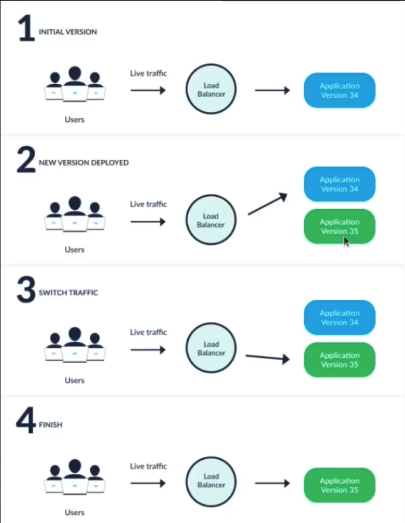
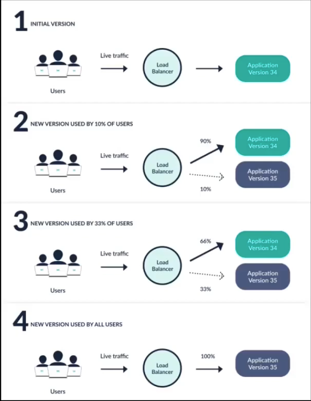

Argo rollouts is a kubernetes controller and a set of crds which provide advanced deployment capability such as **blue green deployment** and **canary deployment**, and also progressive delivery features to kubernetes.
 

There are some difference between 2 different objects. **The native kubernetes deployment object** vs **argo-rollouts**
 

**The native kubernetes deployment object** supports the rolling update strategy which provides a basic set of safety guarantees such as readiness probes during an update, however the rolling update strategy faces many limitations.
 

Limitations of **deployment object**.
- few controls over the speed of the rollout
- inability to control the traffic flow to the new version
- no ability to query external metrics to verify an update
- unable to automatically abort and rollback the update

 

Features of **argo-rollouts**
- blue green update strategy
- canary update strategy
- ingress controller integration
- service mesh integration
- automated rollbacks and automated promotions

 

Use cases of **argo-rollouts**
 
Let's imagine that a user wants to run a last minute functional test on the new version, before it starts to serve production traffic.
- blue-green deployment strategy
  Argo rollouts allows users to specify a active service and preview service. 
  The rollout will configure the preview service to send traffic to the new version while the active service continues to receive production traffic. 
  Once a user is satisfied they can promote the preview service to be the new active service. 
- canary deployment strategy
  A user wants to slowly give the new version more production traffic, it starts by giving a small percentage of the live traffic and wait a while before giving the new version more traffic, eventually the new version will receive all the production traffic. 
  The user specifies the percentage they want the new version to receive and the amount time to wait between percentages.

 

**Deployment strategies**
- **The native kubernetes deployment object**
    - Rolling-update slowly
        Replace the old version with the new version. 
        As the new version comes up the old version scales down in order to maintain the overall count of the application. 
        This is the default strategy of the deployment. 
    - Recreate
        Deletes the old version of the application before bring up the new version. 
        This ensures that 2 versions of the application never run in the same time but there is downtime during the deployment. 

- **Argo-rollouts**
    - Rolling-update
        This is the mutual deployment strategy between this 2 different objects. 
    - Blue-green
        Both the new version and old version of the application deployed at the same time. 
        During this time only the old version of the application will receive the production traffic, this allows the developers to run tests against new version before switching the live traffic to the new version. 
        Then switch traffic to the new version of our application and then delete the previous version. 
        
    - Canary deployment
        Exposes a subset of users to the new version of the application while serving the rest of the traffic to the old version of the application. 
        Once the new version is verified to be correct the new version can replace the old version. 
        

 

**Components of argo-rollouts**
- controller
    - This is the main controller that monitors the cluster for events and reacts whenever a resource of type rollout is changed. The controller will read all the details of the rollout and bring the cluster to the same state as described in the rollout definition.
- rollout resource
    - Is a custom kubernetes resource introduced and managed by argo-rollout. 
    - It's mostly compatible with the native kubernetes deployment resource, but with extra fields that control the stages threshold and methods of advanced deployment methods such as canary and blue-green deployments.
- ingress/service
    - This is the mechanism that traffic from live users enters your cluster and is redirected to the appropriate version.
- AnalysisTemplate
    - Analysis is the capability to connect a rollout to your metric provider and define a specific threshold for certain metrics that will decide if an update is successful or not. 
    - For each analysis you can define one or more metrics queries along with their expected results. 
    - A rollout will progress on it's own if metric queries are good, rollback automatically if metrics show failure, and pause the rollout if metric cannot provide a success or failure answer.
- Metric Providers
    Argo-rollout includes native integration for several popular providers that you can use in the analysis resources to automatically promote or rollback a rollout.

**Argo rollouts** controller will only respond to those changes that happen in rollout sources, it will do nothing for normal deployment resources, this means that I need to migrate my deployments to rollouts if I want to manage them with rollout.
 
I can install argo-rollout in a cluster that is also deploying applications with alternative methods, there are no conflicts between different methods.
 

This is the [argo-rollouts git repository](https://github.com/argoproj/argo-rollouts)
 

This is a [argo-rollouts blue-green deployment](https://github.com/argoproj/argo-rollouts/blob/master/examples/rollout-bluegreen.yaml)
 
 

Argo-rollout use the standard kubernetes service resource but with some extra metadata needed for management.
 
Argo-rollout is very flexible on networking options, you can have different services during a rollout that go only to the new version, only to the old version or both.