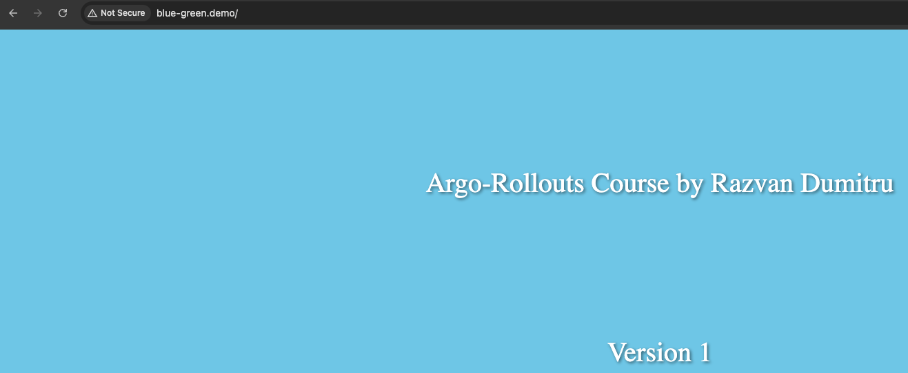

Argo-rollouts work similar to the deployment object.
 

The argo-rollouts will manage the creation scaling and deletion of replicasets. This replicasets are defined by the **spec.template** field inside the rollout resource which uses the same pod template as the deployment object.
 

**12-argo-rollouts-blue-green/blue-green-manifests/rollout.yaml**
 

    apiVersion: argoproj.io/v1alpha1
    kind: Rollout
    metadata:
      name: blue-green-deployment
    spec:
      replicas: 4
      selector:
        matchLabels:
          app: blue-green-deployment
      template:
        metadata:
          labels:
            app: blue-green-deployment
        spec:
          containers:
          - name: blue-green
            image: micutzu/blue-green
            imagePullPolicy: Never
            env:
            - name: html_name
              value: "app-v1.html"
            ports:
            - containerPort: 5000
      strategy:
        blueGreen: 
          activeService: rollout-bluegreen-active
          previewService: rollout-bluegreen-preview
          autoPromotionEnabled: false    # autoPromotion enabled will make the rollout automatically promote the new replicaset to the active service, once the new replicaset is healthy
          # abortScaleDownDelaySeconds: 10
          # autoPromotionEnabled: false
          # scaleDownDelaySeconds: 60
          # previewReplicaCount: 2
          # autoPromotionSeconds: 20
    ---
    kind: Service
    apiVersion: v1
    metadata:
      name: rollout-bluegreen-active
    spec:
      selector:
        app: blue-green-deployment                # Points to the rollout
      ports:
      - protocol: TCP
        port: 5000
        targetPort: 5000

    ---
    kind: Service
    apiVersion: v1
    metadata:
      name: rollout-bluegreen-preview
    spec:
      selector:
        app: blue-green-deployment                # Points to the rollout
      ports:
      - protocol: TCP
        port: 5000
        targetPort: 5000

The most important field is **spec.template**.
 

When **spec.template** is changed it signals to the argo-rollouts controller that the new replicaset will be created.
 
The controller will use the strategy set within **spec.strategy** field in order to determine how the rollout will progress from the old replica set to the new replicaset.
 
Once the new replicaset is scaled up the controller will mark it as stable.
 

We are using **blue-green** strategy for this rollout.
 

In the above file we have 2 services.
- active service
- preview service
As well we have a rollout with a label **app: blue-green-deployment**, and we are using an image called **spec.template**.
 

    rollout:
    labels:
      app: blue-green-deployment
    image:
      name: blue-green:v1

That 2 services point to this rollout. active and preview point to this rollout because it uses the selector **app: blue-green-deployment**.
 

**active** service
 

    app: blue-green-deployment

**preview** service
 

    app: blue-green-deployment

 

After a while we decide to release the second version of our application and therefor we change something under **spec.template** field, and a new replicaset is created for the new version.
 

I modify the name of the image from **blue-green:v1** to **blue-green:v2**
 

    rollout:
    labels:
      app: blue-green-deployment
    image:
      name: blue-green:v2

At this point active service points to v1 and preview points to v2.
 

The replicaset has a unique hash and when we modify the image name under **spec.template** a new replicaset will be created with it's own unique hash.
 
At this point we have 2 replicasets one for the v1 application and one for the v2 application.
 

Arggo-rollout knows to point the **preview** service to the new replicaset and the **active** service to the old replicaset because the **rollout-controller** ensures proper traffic routing by injecting a unique hash of the replicaset to this services.
 

Because of that argo-rollout controller modify the service selector and add a new selector for this 2 services.
 
Then the new selector for the services is like this.
 

**active** service
 

    app: blue-green-deployment
    pod-template-hash: v1_replicaset_hash

**preview** service
 

    app: blue-green-deployment
    pod-template-hash: v2_replicaset_hash
 

Argo-rollouts controller modify the services selector and ads a new selector for this 2 services and the value for this selector is the unique hash of the replicaset.
 
In this situation our users are using the first version of our application.
 
If we wont our users to use the second version of our application, we can promote the rollout. If we promote the rollout argo-rollouts controller will modify the selector related to active service.
 
In this time the argo-rollouts controller will remove this unique hash from active service selector and replace it with the unique hash related to the new replicaset.
 
In this situation both of the services point to the second version of our application.
 

Under **spec.strategy.bluegreen** we have some options
- activeService: rollout-bluegreen-active
    - Specifies the active service
- previewService: rollout-bluegreen-preview
    - Specifies the preview service
- autoPromotionEnabled: false
    - autoPromotion enabled will make the rollout automatically promote the new replicaset to the active service, once the new replicaset is healthy.
    - The default of this option is true, this means that we need to promote it manually.
- abortScaleDownDelaySeconds: 10
- autoPromotionEnabled: false
- scaleDownDelaySeconds: 60
- previewReplicaCount: 2
- autoPromotionSeconds: 20

 

**12-argo-rollouts-blue-green/blue-green-manifests/ingress.yaml**
 

    apiVersion: networking.k8s.io/v1
    kind: Ingress
    metadata:
      name: blue-green-ingress
    spec:
      ingressClassName: nginx
      rules:
      - host: blue-green.demo
        http:
          paths:
          - path: /
            pathType: Prefix
            backend:
              service:
                name: rollout-bluegreen-active
                port:
                  number: 5000

We are using nginx ingress controller to point to active service.
 

Because the host is blue-green.demo, please add **127.0.0.1       blue-green.demo** to **/etc/hosts**, to be able to access it.

 

    kubectl create ns blue-green
    kubectl apply -f rollout.yaml -n blue-green
      rollout.argoproj.io/blue-green-deployment created
      service/rollout-bluegreen-active created
      service/rollout-bluegreen-preview created

    kubectl argo rollouts list rollouts -n blue-green
      NAME                   STRATEGY   STATUS        STEP  SET-WEIGHT  READY  DESIRED  UP-TO-DATE  AVAILABLE
      blue-green-deployment  BlueGreen  Healthy       -     -           4/4    4        4           4
    kubectl argo rollouts get rollouts blue-green-deployment -n blue-green
      Name:            blue-green-deployment
      Namespace:       blue-green
      Status:          ✔ Healthy
      Strategy:        BlueGreen
      Images:          micutzu/blue-green (stable, active)
      Replicas:
        Desired:       4
        Current:       4
        Updated:       4
        Ready:         4
        Available:     4

      NAME                                               KIND        STATUS     AGE  INFO
      ⟳ blue-green-deployment                            Rollout     ✔ Healthy  61s
      └──# revision:1
         └──⧉ blue-green-deployment-57b948686d           ReplicaSet  ✔ Healthy  61s  stable,active
            ├──□ blue-green-deployment-57b948686d-cn7df  Pod         ✔ Running  61s  ready:1/1
            ├──□ blue-green-deployment-57b948686d-jdmnj  Pod         ✔ Running  61s  ready:1/1
            ├──□ blue-green-deployment-57b948686d-lprtt  Pod         ✔ Running  61s  ready:1/1
            └──□ blue-green-deployment-57b948686d-x68v4  Pod         ✔ Running  61s  ready:1/1

    kubectl apply -f ingress.yaml -n blue-green
      ingress.networking.k8s.io/blue-green-ingress created

Now access **http://blue-green.demo** in the browser.
 

 
Now to see the replicaset
 

    k get rs -n blue-green
      NAME                               DESIRED   CURRENT   READY   AGE
      blue-green-deployment-57b948686d   4         4         4       106s 

At this moment bot **active** and **preview** services have the **app: blue-green-deployment** selector, but in this situation for the first version of the application **argo-rollouts controller** is responsible to add a selector to this services.
 

    k get svc -n blue-green
      NAME                        TYPE        CLUSTER-IP    EXTERNAL-IP   PORT(S)    AGE
      rollout-bluegreen-active    ClusterIP   10.96.14.84   <none>        5000/TCP   5m38s
      rollout-bluegreen-preview   ClusterIP   10.96.63.34   <none>        5000/TCP   5m38s

    k get svc rollout-bluegreen-active -n blue-green -o yaml
      apiVersion: v1
      kind: Service
      metadata:
        annotations:
          argo-rollouts.argoproj.io/managed-by-rollouts: blue-green-deployment
          kubectl.kubernetes.io/last-applied-configuration: |
            {"apiVersion":"v1","kind":"Service","metadata":{"annotations":{},"name":"rollout-bluegreen-active","namespace":"blue-green"},"spec":{"ports":[{"port":5000,"protocol":"TCP","targetPort":5000}],"selector":{"app":"blue-green-deployment"}}}
        creationTimestamp: "2025-03-06T10:05:30Z"
        name: rollout-bluegreen-active
        namespace: blue-green
        resourceVersion: "1615095"
        uid: 96020c69-4e39-4e93-8d20-c46e6f200cbe
      spec:
        clusterIP: 10.96.14.84
        clusterIPs:
        - 10.96.14.84
        internalTrafficPolicy: Cluster
        ipFamilies:
        - IPv4
        ipFamilyPolicy: SingleStack
        ports:
        - port: 5000
          protocol: TCP
          targetPort: 5000
        selector:
          app: blue-green-deployment
          rollouts-pod-template-hash: 57b948686d      # This is the selector added by the **argo-rollouts controller**, **57b948686d** is the hash of the above replicaset
        sessionAffinity: None
        type: ClusterIP
      status:
        loadBalancer: {}