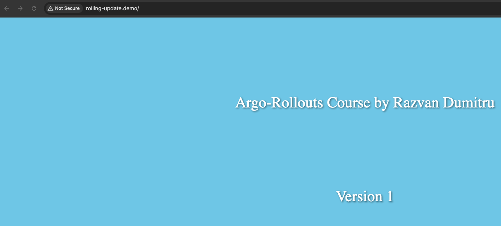
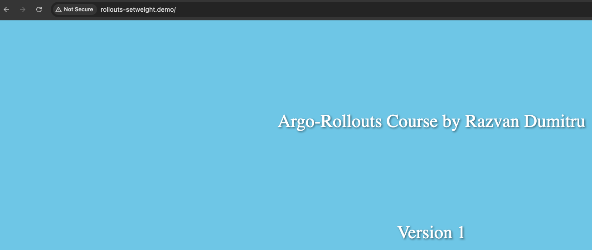
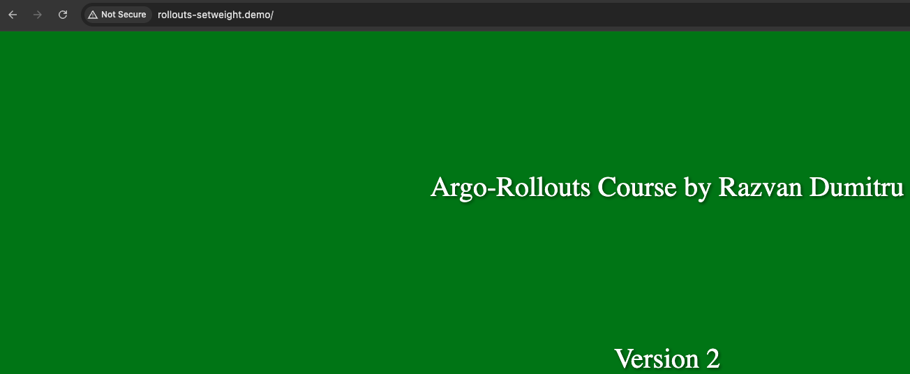
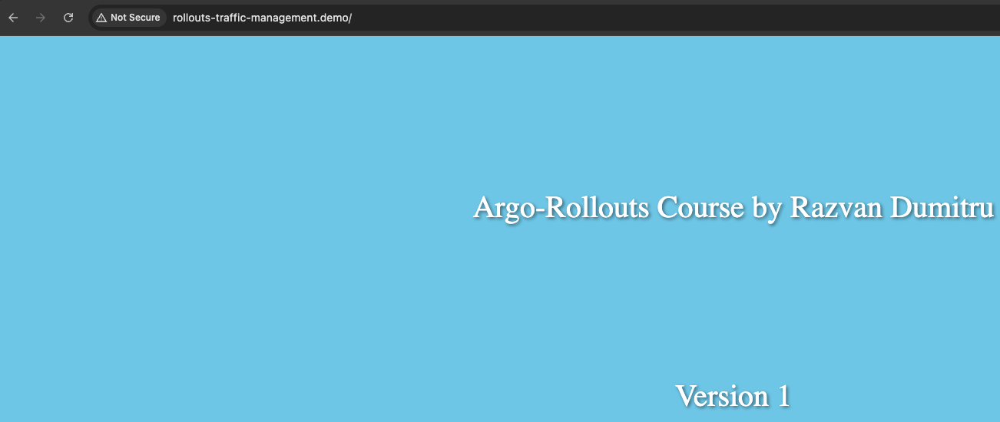

There are multiple ways to use canary strategy.
 

- RollingUpdate
  - Is available in kubernetes deployment object too.
  - We have 2 important options
    - maxSurge
      - Specifies the maximum number of pods that can be created above the desired number of replicas during the rolling update process
      - **maxSurge: 1**, Kubernetes will only create one new pod above the desired number of replicas.
    - maxUnavailable
      - Specifies the maximum number of pods that can be unavailable during the rolling update process.
      - **maxUnavailable: 2** Kubernetes will ensure that at least 3 pods are available at all time during the update process.
- SetWeight
  - Dictates the percentage of traffic that should be sent to the canary.
- traffic-management/traffic-routing
  - We can use an ingress controller to manage the traffic and to route the traffic.

 

### Rolling update
 

**13-argo-rollouts-canary/rolling-update.yaml**
 

    apiVersion: argoproj.io/v1alpha1
    kind: Rollout
    metadata:
      name: rolling-update
    spec:
      replicas: 5
      strategy:
        canary:
          maxSurge: 2
          maxUnavailable: 2
      selector:
        matchLabels:
          app: rolling-update
      template:
        metadata:
          labels:
            app: rolling-update
        spec:
          containers:
          - name: rolling-update
            image: micutzu/canary # This is the same image that we built in the previous session (12-argo-rollouts-blue-green) , I just re-tagged it
            env:
            - name: html_name
              value: "app-v1.html"
            ports:
            - containerPort: 5000
    ---
    apiVersion: v1
    kind: Service
    metadata:
      name: rolling-update
    spec:
      ports:
      - port: 5000
        targetPort: 5000
      selector:
        app: rolling-update

**13-argo-rollouts-canary/rolling-update-ingress.yaml**
 

    apiVersion: networking.k8s.io/v1
    kind: Ingress
    metadata:
      name: rolling-update
    spec:
      ingressClassName: nginx
      rules:
      - host: rolling-update.demo
        http:
          paths:
          - path: /
            pathType: Prefix
            backend:
              service:
                name: rolling-update
                port:
                  number: 5000

 

    kubectl create ns canary
    kubectl apply -f rolling-update.yaml -n canary
      rollout.argoproj.io/rolling-update created
      service/rolling-update created

    kubectl apply -f rolling-update-ingress.yaml -n canary
      ingress.networking.k8s.io/rolling-update created

    kubectl argo rollouts list rollouts -n canary
      NAME            STRATEGY   STATUS        STEP  SET-WEIGHT  READY  DESIRED  UP-TO-DATE  AVAILABLE
      rolling-update  Canary     Healthy       -     100         5/5    5        5           5  

    kubectl argo rollouts get rollouts rolling-update -n canary
      Name:            rolling-update
      Namespace:       canary
      Status:          ✔ Healthy
      Strategy:        Canary
        Step:
        SetWeight:     100
        ActualWeight:  100
      Images:          micutzu/canary (stable)
      Replicas:
        Desired:       5
        Current:       5
        Updated:       5
        Ready:         5
        Available:     5

      NAME                                        KIND        STATUS     AGE  INFO
      ⟳ rolling-update                            Rollout     ✔ Healthy  88s
      └──# revision:1
         └──⧉ rolling-update-6456886cb6           ReplicaSet  ✔ Healthy  88s  stable
            ├──□ rolling-update-6456886cb6-7nzl5  Pod         ✔ Running  88s  ready:1/1
            ├──□ rolling-update-6456886cb6-jwrfd  Pod         ✔ Running  88s  ready:1/1
            ├──□ rolling-update-6456886cb6-kgpws  Pod         ✔ Running  88s  ready:1/1
            ├──□ rolling-update-6456886cb6-ndpsg  Pod         ✔ Running  88s  ready:1/1
            └──□ rolling-update-6456886cb6-wd8wv  Pod         ✔ Running  88s  ready:1/1

Add the **rolling-update.demo** to **/etc/hosts** in order to access **http://rolling-update.demo**
 

At this moment we deployed the version 1 of the application and we have only 1 replicaset.
 

 

    kubectl get rs -n canary
      NAME                        DESIRED   CURRENT   READY   AGE
      rolling-update-6456886cb6   5         5         5       6m36s

By modifying the the html_name environment from **app-v1.html** to **app-v2.html** a new replicaset will be created.
 

    kubectl apply -f rolling-update.yaml -n canary
      rollout.argoproj.io/rolling-update configured
      service/rolling-update unchanged

    kubectl get rs -n canary
      NAME                        DESIRED   CURRENT   READY   AGE
      rolling-update-6456886cb6   0         0         0       14m
      rolling-update-6754ff6477   5         5         5       53s

    kubectl argo rollouts get rollouts rolling-update -n canary
      Name:            rolling-update
      Namespace:       canary
      Status:          ✔ Healthy
      Strategy:        Canary
        Step:
        SetWeight:     100
        ActualWeight:  100
      Images:          micutzu/canary (stable)
      Replicas:
        Desired:       5
        Current:       5
        Updated:       5
        Ready:         5
        Available:     5

      NAME                                        KIND        STATUS        AGE  INFO
      ⟳ rolling-update                            Rollout     ✔ Healthy     15m
      ├──# revision:2
      │  └──⧉ rolling-update-6754ff6477           ReplicaSet  ✔ Healthy     91s  stable
      │     ├──□ rolling-update-6754ff6477-d99dd  Pod         ✔ Running     91s  ready:1/1
      │     ├──□ rolling-update-6754ff6477-gr7mt  Pod         ✔ Running     91s  ready:1/1
      │     ├──□ rolling-update-6754ff6477-jfllm  Pod         ✔ Running     91s  ready:1/1
      │     ├──□ rolling-update-6754ff6477-nzjfl  Pod         ✔ Running     91s  ready:1/1
      │     └──□ rolling-update-6754ff6477-fgp8x  Pod         ✔ Running     89s  ready:1/1
      └──# revision:1
         └──⧉ rolling-update-6456886cb6           ReplicaSet  • ScaledDown  15m

 

### setWeight

**13-argo-rollouts-canary/rollouts-setweight.yaml**
 

    apiVersion: argoproj.io/v1alpha1
      kind: Rollout
      metadata:
        name: rollouts-setweight
      spec:
        replicas: 5
        strategy:
          canary:
            steps:
            - setWeight: 20             # 20% of 5 is 1
            - pause: {}                 # The rollout will pause undefinetily needs to be promoted manually
            - setWeight: 40             # 40% of 5 is 2
            - pause: {duration: 10s}    # The rollout will be paused for 10 seconds
            - setWeight: 60             # 60% of 5 is 3
            - pause: {duration: 20s}    # The rollout will be paused for for 20 seconds
            - setWeight: 80             # 80% of 5 is 1
            - pause: {duration: 1m}     # The rollout will be paused for 1 minute and after this all the traffic should be send to the new version.
        selector:
          matchLabels:
            app: rollouts-setweight
        template:
          metadata:
            labels:
              app: rollouts-setweight
          spec:
            containers:
            - name: rollouts-setweight
              image: micutzu/canary # This is the same image that we built in the previous session (12-argo-rollouts-blue-green) , I just re-tagged it
              env:
              - name: html_name
                value: "app-v1.html"
              ports:
              - containerPort: 5000
      ---
      apiVersion: v1
      kind: Service
      metadata:
        name: rollouts-setweight
      spec:
        ports:
        - port: 5000
          targetPort: 5000
        selector:
          app: rollouts-setweight

The most important thing in this rollout is **steps**, we have a list of steps and each step can have 1 of 2 fields **setWeight** or **pause**.
 

The **setWeight** field dictates the percentage of traffic that should be sent to the canary.
 

**setWeight: 20** means that 20% of the traffic should be sent to the canary. 20% of 5 pods is 1, so we have one pod for the new version of the application.
**pause: {}** instructs the rollout to pause. Because the **pause struct** does not have any duration set it will wait until we promote it manually.
 

If the duration field within the **pause struct** is set, the rollout will not progress the next step until it was not waited for the value of the duration field, otherwise the rollout will wait indefinitely until we promote the rollout manually.
 

**13-argo-rollouts-canary/rollouts-setweight-ingress.yaml**
 

    apiVersion: networking.k8s.io/v1
    kind: Ingress
    metadata:
      name: rolling-update
    spec:
      ingressClassName: nginx
      rules:
      - host: rollouts-setweight.demo
        http:
          paths:
          - path: /
            pathType: Prefix
            backend:
              service:
                name: rollouts-setweight
                port:
                  number: 5000

 

    kubectl apply -f rollouts-setweight.yaml -n canary
      rollout.argoproj.io/rollouts-setweight created
      service/rollouts-setweight created

    kubectl apply -f rollouts-setweight-ingress.yaml -n canary
      ingress.networking.k8s.io/rolling-update created

    kubectl argo rollouts list rollouts -n canary
      NAME                STRATEGY   STATUS        STEP  SET-WEIGHT  READY  DESIRED  UP-TO-DATE  AVAILABLE
      rollouts-setweight  Canary     Healthy       8/8   100         5/5    5        5           5

    kubectl argo rollouts get rollouts rollouts-setweight -n canary
      Name:            rollouts-setweight
      Namespace:       canary
      Status:          ✔ Healthy
      Strategy:        Canary
        Step:          8/8
        SetWeight:     100
        ActualWeight:  100
      Images:          micutzu/canary (stable)
      Replicas:
        Desired:       5
        Current:       5
        Updated:       5
        Ready:         5
        Available:     5

      NAME                                            KIND        STATUS     AGE  INFO
      ⟳ rollouts-setweight                            Rollout     ✔ Healthy  84s
      └──# revision:1
         └──⧉ rollouts-setweight-58bd5bd9fd           ReplicaSet  ✔ Healthy  84s  stable
            ├──□ rollouts-setweight-58bd5bd9fd-7cjwg  Pod         ✔ Running  84s  ready:1/1
            ├──□ rollouts-setweight-58bd5bd9fd-9nmkg  Pod         ✔ Running  84s  ready:1/1
            ├──□ rollouts-setweight-58bd5bd9fd-j5sc5  Pod         ✔ Running  84s  ready:1/1
            ├──□ rollouts-setweight-58bd5bd9fd-ls8dt  Pod         ✔ Running  84s  ready:1/1
            └──□ rollouts-setweight-58bd5bd9fd-p9c27  Pod         ✔ Running  84s  ready:1/1

Based on the set weight ingress access **http://rollouts-setweight.demo**
 

 

Now modify the **value: "app-v1.html"** env to **value: "app-v2.html"** to create a new replicaset and start canary.
 

    kubectl apply -f rollouts-setweight.yaml -n canary
      rollout.argoproj.io/rollouts-setweight configured
      service/rollouts-setweight unchanged

At this point if you refresh the page multiple times you will see that the version 2 of the app will be shown.
 
Also at this point because of **- pause: {}** the rollout is paused undefinetily and needs to be manually promoted.
 

    kubectl argo rollouts get rollouts rollouts-setweight -n canary
      Name:            rollouts-setweight
      Namespace:       canary
      Status:          ॥ Paused
      Message:         CanaryPauseStep
      Strategy:        Canary
        Step:          1/8
        SetWeight:     20
        ActualWeight:  20
      Images:          micutzu/canary (canary, stable)
      Replicas:
        Desired:       5
        Current:       5
        Updated:       1
        Ready:         5
        Available:     5

      NAME                                            KIND        STATUS     AGE    INFO
      ⟳ rollouts-setweight                            Rollout     ॥ Paused   9m14s
      ├──# revision:2
      │  └──⧉ rollouts-setweight-547ff57849           ReplicaSet  ✔ Healthy  2m58s  canary
      │     └──□ rollouts-setweight-547ff57849-2wt7c  Pod         ✔ Running  2m58s  ready:1/1
      └──# revision:1
         └──⧉ rollouts-setweight-58bd5bd9fd           ReplicaSet  ✔ Healthy  9m14s  stable
            ├──□ rollouts-setweight-58bd5bd9fd-7cjwg  Pod         ✔ Running  9m14s  ready:1/1
            ├──□ rollouts-setweight-58bd5bd9fd-9nmkg  Pod         ✔ Running  9m14s  ready:1/1
            ├──□ rollouts-setweight-58bd5bd9fd-j5sc5  Pod         ✔ Running  9m14s  ready:1/1
            └──□ rollouts-setweight-58bd5bd9fd-p9c27  Pod         ✔ Running  9m14s  ready:1/1

 

    kubectl argo rollouts promote rollouts-setweight -n canary
    kubectl argo rollouts get rollouts rollouts-setweight -n canary
      Name:            rollouts-setweight
      Namespace:       canary
      Status:          ◌ Progressing
      Message:         more replicas need to be updated
      Strategy:        Canary
        Step:          2/8
        SetWeight:     40
        ActualWeight:  25
      Images:          micutzu/canary (canary, stable)
      Replicas:
        Desired:       5
        Current:       5
        Updated:       2
        Ready:         4
        Available:     4

      NAME                                            KIND        STATUS               AGE    INFO
      ⟳ rollouts-setweight                            Rollout     ◌ Progressing        10m
      ├──# revision:2
      │  └──⧉ rollouts-setweight-547ff57849           ReplicaSet  ◌ Progressing        4m17s  canary
      │     ├──□ rollouts-setweight-547ff57849-2wt7c  Pod         ✔ Running            4m17s  ready:1/1
      │     └──□ rollouts-setweight-547ff57849-rtbxs  Pod         ◌ ContainerCreating  2s     ready:0/1
      └──# revision:1
         └──⧉ rollouts-setweight-58bd5bd9fd           ReplicaSet  ✔ Healthy            10m    stable
            ├──□ rollouts-setweight-58bd5bd9fd-7cjwg  Pod         ✔ Running            10m    ready:1/1
            ├──□ rollouts-setweight-58bd5bd9fd-9nmkg  Pod         ✔ Running            10m    ready:1/1
            ├──□ rollouts-setweight-58bd5bd9fd-j5sc5  Pod         ◌ Terminating        10m    ready:1/1
            └──□ rollouts-setweight-58bd5bd9fd-p9c27  Pod         ✔ Running            10m    ready:1/1

 

    kubectl argo rollouts get rollouts rollouts-setweight -n canary
      Name:            rollouts-setweight
      Namespace:       canary
      Status:          ॥ Paused
      Message:         CanaryPauseStep
      Strategy:        Canary
        Step:          3/8
        SetWeight:     40
        ActualWeight:  40
      Images:          micutzu/canary (canary, stable)
      Replicas:
        Desired:       5
        Current:       5
        Updated:       2
        Ready:         5
        Available:     5

      NAME                                            KIND        STATUS         AGE    INFO
      ⟳ rollouts-setweight                            Rollout     ॥ Paused       10m
      ├──# revision:2
      │  └──⧉ rollouts-setweight-547ff57849           ReplicaSet  ✔ Healthy      4m26s  canary
      │     ├──□ rollouts-setweight-547ff57849-2wt7c  Pod         ✔ Running      4m26s  ready:1/1
      │     └──□ rollouts-setweight-547ff57849-rtbxs  Pod         ✔ Running      11s    ready:1/1
      └──# revision:1
         └──⧉ rollouts-setweight-58bd5bd9fd           ReplicaSet  ✔ Healthy      10m    stable
            ├──□ rollouts-setweight-58bd5bd9fd-7cjwg  Pod         ✔ Running      10m    ready:1/1
            ├──□ rollouts-setweight-58bd5bd9fd-9nmkg  Pod         ✔ Running      10m    ready:1/1
            ├──□ rollouts-setweight-58bd5bd9fd-j5sc5  Pod         ◌ Terminating  10m    ready:1/1
            └──□ rollouts-setweight-58bd5bd9fd-p9c27  Pod         ✔ Running      10m    ready:1/1

 

    kubectl argo rollouts get rollouts rollouts-setweight -n canary
      Name:            rollouts-setweight
      Namespace:       canary
      Status:          ॥ Paused
      Message:         CanaryPauseStep
      Strategy:        Canary
        Step:          5/8
        SetWeight:     60
        ActualWeight:  60
      Images:          micutzu/canary (canary, stable)
      Replicas:
        Desired:       5
        Current:       5
        Updated:       3
        Ready:         5
        Available:     5

      NAME                                            KIND        STATUS         AGE    INFO
      ⟳ rollouts-setweight                            Rollout     ॥ Paused       10m
      ├──# revision:2
      │  └──⧉ rollouts-setweight-547ff57849           ReplicaSet  ✔ Healthy      4m35s  canary
      │     ├──□ rollouts-setweight-547ff57849-2wt7c  Pod         ✔ Running      4m35s  ready:1/1
      │     ├──□ rollouts-setweight-547ff57849-rtbxs  Pod         ✔ Running      20s    ready:1/1
      │     └──□ rollouts-setweight-547ff57849-82s2q  Pod         ✔ Running      8s     ready:1/1
      └──# revision:1
         └──⧉ rollouts-setweight-58bd5bd9fd           ReplicaSet  ✔ Healthy      10m    stable
            ├──□ rollouts-setweight-58bd5bd9fd-7cjwg  Pod         ✔ Running      10m    ready:1/1
            ├──□ rollouts-setweight-58bd5bd9fd-9nmkg  Pod         ✔ Running      10m    ready:1/1
            ├──□ rollouts-setweight-58bd5bd9fd-j5sc5  Pod         ◌ Terminating  10m    ready:1/1
            └──□ rollouts-setweight-58bd5bd9fd-p9c27  Pod         ◌ Terminating  10m    ready:1/1

 

    kubectl argo rollouts get rollouts rollouts-setweight -n canary
      Name:            rollouts-setweight
      Namespace:       canary
      Status:          ॥ Paused
      Message:         CanaryPauseStep
      Strategy:        Canary
        Step:          7/8
        SetWeight:     80
        ActualWeight:  80
      Images:          micutzu/canary (canary, stable)
      Replicas:
        Desired:       5
        Current:       5
        Updated:       4
        Ready:         5
        Available:     5

      NAME                                            KIND        STATUS         AGE    INFO
      ⟳ rollouts-setweight                            Rollout     ॥ Paused       11m
      ├──# revision:2
      │  └──⧉ rollouts-setweight-547ff57849           ReplicaSet  ✔ Healthy      4m50s  canary
      │     ├──□ rollouts-setweight-547ff57849-2wt7c  Pod         ✔ Running      4m50s  ready:1/1
      │     ├──□ rollouts-setweight-547ff57849-rtbxs  Pod         ✔ Running      35s    ready:1/1
      │     ├──□ rollouts-setweight-547ff57849-82s2q  Pod         ✔ Running      23s    ready:1/1
      │     └──□ rollouts-setweight-547ff57849-6m5rx  Pod         ✔ Running      2s     ready:1/1
      └──# revision:1
         └──⧉ rollouts-setweight-58bd5bd9fd           ReplicaSet  ✔ Healthy      11m    stable
            ├──□ rollouts-setweight-58bd5bd9fd-7cjwg  Pod         ◌ Terminating  11m    ready:1/1
            ├──□ rollouts-setweight-58bd5bd9fd-9nmkg  Pod         ✔ Running      11m    ready:1/1
            └──□ rollouts-setweight-58bd5bd9fd-p9c27  Pod         ◌ Terminating  11m    ready:1/1

 

    kubectl argo rollouts get rollouts rollouts-setweight -n canary
      Name:            rollouts-setweight
      Namespace:       canary
      Status:          ✔ Healthy
      Strategy:        Canary
        Step:          8/8
        SetWeight:     100
        ActualWeight:  100
      Images:          micutzu/canary (stable)
      Replicas:
        Desired:       5
        Current:       5
        Updated:       5
        Ready:         5
        Available:     5

      NAME                                            KIND        STATUS        AGE    INFO
      ⟳ rollouts-setweight                            Rollout     ✔ Healthy     13m
      ├──# revision:2
      │  └──⧉ rollouts-setweight-547ff57849           ReplicaSet  ✔ Healthy     7m18s  stable
      │     ├──□ rollouts-setweight-547ff57849-2wt7c  Pod         ✔ Running     7m18s  ready:1/1
      │     ├──□ rollouts-setweight-547ff57849-rtbxs  Pod         ✔ Running     3m3s   ready:1/1
      │     ├──□ rollouts-setweight-547ff57849-82s2q  Pod         ✔ Running     2m51s  ready:1/1
      │     ├──□ rollouts-setweight-547ff57849-6m5rx  Pod         ✔ Running     2m30s  ready:1/1
      │     └──□ rollouts-setweight-547ff57849-h29fx  Pod         ✔ Running     89s    ready:1/1
      └──# revision:1
         └──⧉ rollouts-setweight-58bd5bd9fd           ReplicaSet  • ScaledDown  13m

 

 

Round up with **setWeight**.
 

5 replicas 
setWeight: 30 
pause: {} 

30% of 5 is 1.5. The 1.5 will be rounded to 2. So this means that the new version will have 2 replicas. 
100% - 30% = 70% 
70% of 5 is 3.5. The 3.5 will be rounded to 4. So this means that the old version will have 4 replicas.
 

### ingress
 

    apiVersion: argoproj.io/v1alpha1
    kind: Rollout
    metadata:
      name: rollouts-traffic-management
    spec:
      replicas: 5
      strategy:
        canary:
          # dynamicStableScale: true
          # abortScaleDownDelaySeconds: 20
          canaryService: canary-service
          stableService: stable-service
          trafficRouting:
            nginx:
              stableIngress: rollouts-traffic-management
          steps:
          - setWeight: 20 # Using Setweight Only
          - pause: {}
          # ....................
          # - setCanaryScale: # Using SetCanaryScale with SetWeight
          #    weight: 40
          ##   replicas: 2    # We can use either replicas either weight
          # - setWeight: 40
          # - pause: {}
      selector:
        matchLabels:
          app: rollouts-traffic-management
      template:
        metadata:
          labels:
            app: rollouts-traffic-management
        spec:
          containers:
          - name: rollouts-traffic-management
            image: micutzu/canary # This is the same image that we built in the previous session (12-argo-rollouts-blue-green) , I just re-tagged it
            env:
            - name: html_name
              value: "app-v1.html"
            ports:
            - containerPort: 5000
    ---
    apiVersion: v1
    kind: Service
    metadata:
      name: canary-service
    spec:
      ports:
      - port: 5000
        targetPort: 5000
      selector:
        app: rollouts-traffic-management
    ---
    apiVersion: v1
    kind: Service
    metadata:
      name: stable-service
    spec:
      ports:
      - port: 5000
        targetPort: 5000
      selector:
        app: rollouts-traffic-management

We have a rollout with **app: rollouts-traffic-management** label.
 

    Rollout:
      app: rollouts-traffic-management

We have 2 services **canary-service** and **stable-service** which points to the same replicaset of the rollout.
 

    canary-service:
      selector:
        app: rollouts-traffic-management

    stable-service:
      selector:
        app: rollouts-traffic-management

Let's imagine that we are in revision 1 and we have one replicaset only, in this time both of them point to the same replicaset, to the first version of the application.
 

If I change the image name or I change the environment variable or anything else under **spec.template** argo-rollouts controller will create a new replicaset for the new version of the application.
 
In this situation argo-rollouts controller will modify the selector of this 2 services and add another selector to them.
 

    canary-service:
      selector:
        app: rollouts-traffic-management
        pod-template-hash: unique_hash_id_of_the_new_rs

    stable-service:
      selector:
        app: rollouts-traffic-management
        pod-template-hash: unique_hash_id_of_the_old_rs

In this situation **canary-service** points to revision 2 and points to new replicaset, and **stable-service** points to revision 1 and points to the old and stable replicaset.
 

The **pod-template-hash** selector was added by the argo-rollouts controller.
 

Under **spec.strategy.canary** we have some options.
- dynamicStableScale: true
  - The previous revision will be scaled down dynamically.
  - The default value is false
- abortScaleDownDelaySeconds: 20
  - If **dynamicStableScale** is set and the rollout is aborted the canary replicaset will dynamically scale down as traffic shifts back to stable.
- canaryService: canary-service
  - Specifies the canary service
- stableService: stable-service
  - Specifies the stable service
- trafficRouting.nginx.stableIngress: rollouts-traffic-management
  - Is the name of the ingress that we create

**13-argo-rollouts-canary/rollouts-traffic-management-ingress.yaml**
 

    apiVersion: networking.k8s.io/v1
    kind: Ingress
    metadata:
      name: rollouts-traffic-management
    spec:
      ingressClassName: nginx
      rules:
      - host: rollouts-traffic-management.demo
        http:
          paths:
          - path: /
            pathType: Prefix
            backend:
              service:
                name: stable-service
                port:
                  number: 5000

 

    kubectl apply -f rollouts-traffic-management.yaml -n canary
      rollout.argoproj.io/rollouts-traffic-management created
      service/canary-service created
      service/stable-service created

    kubectl apply -f rollouts-traffic-management-ingress.yaml -n canary
      ingress.networking.k8s.io/rollouts-traffic-management created

 

    kubectl argo rollouts list rollouts -n canary
        NAME                         STRATEGY   STATUS        STEP  SET-WEIGHT  READY  DESIRED  UP-TO-DATE  AVAILABLE
        rollouts-traffic-management  Canary     Healthy       2/2   100         5/5    5        5           5

    kubectl argo rollouts get rollouts rollouts-traffic-management -n canary
      Name:            rollouts-traffic-management
      Namespace:       canary
      Status:          ✔ Healthy
      Strategy:        Canary
        Step:          2/2
        SetWeight:     100
        ActualWeight:  100
      Images:          micutzu/canary (stable)
      Replicas:
        Desired:       5
        Current:       5
        Updated:       5
        Ready:         5
        Available:     5

      NAME                                                    KIND        STATUS     AGE   INFO
      ⟳ rollouts-traffic-management                           Rollout     ✔ Healthy  2m4s
      └──# revision:1
         └──⧉ rollouts-traffic-management-8984b5846           ReplicaSet  ✔ Healthy  88s   stable
            ├──□ rollouts-traffic-management-8984b5846-6d2zr  Pod         ✔ Running  78s   ready:1/1
            ├──□ rollouts-traffic-management-8984b5846-6t8pl  Pod         ✔ Running  78s   ready:1/1
            ├──□ rollouts-traffic-management-8984b5846-kcv7x  Pod         ✔ Running  78s   ready:1/1
            ├──□ rollouts-traffic-management-8984b5846-t6gmk  Pod         ✔ Running  78s   ready:1/1
            └──□ rollouts-traffic-management-8984b5846-w8xf9  Pod         ✔ Running  78s   ready:1/1

Access **http://rollouts-traffic-management.demo**
 

 

    kubectl get ingress -n canary
      NAME                                                             CLASS   HOSTS                              ADDRESS     PORTS   AGE
      rollouts-traffic-management                                      nginx   rollouts-traffic-management.demo   localhost   80      3m58s
      rollouts-traffic-management-rollouts-traffic-management-canary   nginx   rollouts-traffic-management.demo   localhost   80      3m44s

We created only the **rollouts-traffic-management** ingress.
 

The **rollouts-traffic-management-rollouts-traffic-management-canary** ingress was created by **argo-rollout controller**
 

Now change the **value: "app-v1.html"** to **value: "app-v2.html"** in order to create a new replicaset.
 

    kubectl apply -f rollouts-traffic-management.yaml -n canary
      rollout.argoproj.io/rollouts-traffic-management configured
      service/canary-service unchanged
      service/stable-service unchanged

    kubectl argo rollouts get rollouts rollouts-traffic-management -n canary
      Name:            rollouts-traffic-management
      Namespace:       canary
      Status:          ॥ Paused
      Message:         CanaryPauseStep
      Strategy:        Canary
        Step:          1/2
        SetWeight:     20
        ActualWeight:  20
      Images:          micutzu/canary (canary, stable)
      Replicas:
        Desired:       5
        Current:       6
        Updated:       1
        Ready:         6
        Available:     6

      NAME                                                     KIND        STATUS     AGE  INFO
      ⟳ rollouts-traffic-management                            Rollout     ॥ Paused   13m
      ├──# revision:2
      │  └──⧉ rollouts-traffic-management-6bdff7cf49           ReplicaSet  ✔ Healthy  35s  canary
      │     └──□ rollouts-traffic-management-6bdff7cf49-vtsqd  Pod         ✔ Running  35s  ready:1/1
      └──# revision:1
         └──⧉ rollouts-traffic-management-8984b5846            ReplicaSet  ✔ Healthy  12m  stable
            ├──□ rollouts-traffic-management-8984b5846-6d2zr   Pod         ✔ Running  12m  ready:1/1
            ├──□ rollouts-traffic-management-8984b5846-6t8pl   Pod         ✔ Running  12m  ready:1/1
            ├──□ rollouts-traffic-management-8984b5846-kcv7x   Pod         ✔ Running  12m  ready:1/1
            ├──□ rollouts-traffic-management-8984b5846-t6gmk   Pod         ✔ Running  12m  ready:1/1
            └──□ rollouts-traffic-management-8984b5846-w8xf9   Pod         ✔ Running  12m  ready:1/1

Based on the rollout only 20% percentage is sent to the new revision, so if you refresh the page multiple times you should be able to see the new application.
 

Also since **pause: {}** is used I need to manually promote the rollout.
 

    kubectl argo rollouts promote rollouts-traffic-management -n canary
      rollout 'rollouts-traffic-management' promoted

    kubectl argo rollouts get rollouts rollouts-traffic-management -n canary
      Name:            rollouts-traffic-management
      Namespace:       canary
      Status:          ◌ Progressing
      Message:         waiting for all steps to complete
      Strategy:        Canary
        Step:          2/2
        SetWeight:     100
        ActualWeight:  100
      Images:          micutzu/canary (canary, stable)
      Replicas:
        Desired:       5
        Current:       10
        Updated:       5
        Ready:         8
        Available:     8

      NAME                                                     KIND        STATUS               AGE    INFO
      ⟳ rollouts-traffic-management                            Rollout     ◌ Progressing        17m
      ├──# revision:2
      │  └──⧉ rollouts-traffic-management-6bdff7cf49           ReplicaSet  ◌ Progressing        5m10s  canary
      │     ├──□ rollouts-traffic-management-6bdff7cf49-vtsqd  Pod         ✔ Running            5m10s  ready:1/1
      │     ├──□ rollouts-traffic-management-6bdff7cf49-5l8xl  Pod         ◌ ContainerCreating  3s     ready:0/1
      │     ├──□ rollouts-traffic-management-6bdff7cf49-d5gvs  Pod         ✔ Running            3s     ready:1/1
      │     ├──□ rollouts-traffic-management-6bdff7cf49-j2ll2  Pod         ✔ Running            3s     ready:1/1
      │     └──□ rollouts-traffic-management-6bdff7cf49-p55g7  Pod         ◌ ContainerCreating  3s     ready:0/1
      └──# revision:1
         └──⧉ rollouts-traffic-management-8984b5846            ReplicaSet  ✔ Healthy            17m    stable
            ├──□ rollouts-traffic-management-8984b5846-6d2zr   Pod         ✔ Running            16m    ready:1/1
            ├──□ rollouts-traffic-management-8984b5846-6t8pl   Pod         ✔ Running            16m    ready:1/1
            ├──□ rollouts-traffic-management-8984b5846-kcv7x   Pod         ✔ Running            16m    ready:1/1
            ├──□ rollouts-traffic-management-8984b5846-t6gmk   Pod         ✔ Running            16m    ready:1/1
            └──□ rollouts-traffic-management-8984b5846-w8xf9   Pod         ✔ Running            16m    ready:1/1

 

    kubectl argo rollouts get rollouts rollouts-traffic-management -n canary
      Name:            rollouts-traffic-management
      Namespace:       canary
      Status:          ✔ Healthy
      Strategy:        Canary
        Step:          2/2
        SetWeight:     100
        ActualWeight:  100
      Images:          micutzu/canary (stable)
      Replicas:
        Desired:       5
        Current:       5
        Updated:       5
        Ready:         5
        Available:     5

      NAME                                                     KIND        STATUS         AGE   INFO
      ⟳ rollouts-traffic-management                            Rollout     ✔ Healthy      18m
      ├──# revision:2
      │  └──⧉ rollouts-traffic-management-6bdff7cf49           ReplicaSet  ✔ Healthy      6m4s  stable
      │     ├──□ rollouts-traffic-management-6bdff7cf49-vtsqd  Pod         ✔ Running      6m4s  ready:1/1
      │     ├──□ rollouts-traffic-management-6bdff7cf49-5l8xl  Pod         ✔ Running      57s   ready:1/1
      │     ├──□ rollouts-traffic-management-6bdff7cf49-d5gvs  Pod         ✔ Running      57s   ready:1/1
      │     ├──□ rollouts-traffic-management-6bdff7cf49-j2ll2  Pod         ✔ Running      57s   ready:1/1
      │     └──□ rollouts-traffic-management-6bdff7cf49-p55g7  Pod         ✔ Running      57s   ready:1/1
      └──# revision:1
         └──⧉ rollouts-traffic-management-8984b5846            ReplicaSet  • ScaledDown   18m
            ├──□ rollouts-traffic-management-8984b5846-6d2zr   Pod         ◌ Terminating  17m   ready:1/1
            ├──□ rollouts-traffic-management-8984b5846-6t8pl   Pod         ◌ Terminating  17m   ready:1/1
            ├──□ rollouts-traffic-management-8984b5846-kcv7x   Pod         ◌ Terminating  17m   ready:1/1
            ├──□ rollouts-traffic-management-8984b5846-t6gmk   Pod         ◌ Terminating  17m   ready:1/1
            └──□ rollouts-traffic-management-8984b5846-w8xf9   Pod         ◌ Terminating  17m   ready:1/1

 

    kubectl argo rollouts get rollouts rollouts-traffic-management -n canary
      Name:            rollouts-traffic-management
      Namespace:       canary
      Status:          ✔ Healthy
      Strategy:        Canary
        Step:          2/2
        SetWeight:     100
        ActualWeight:  100
      Images:          micutzu/canary (stable)
      Replicas:
        Desired:       5
        Current:       5
        Updated:       5
        Ready:         5
        Available:     5

      NAME                                                     KIND        STATUS        AGE    INFO
      ⟳ rollouts-traffic-management                            Rollout     ✔ Healthy     19m
      ├──# revision:2
      │  └──⧉ rollouts-traffic-management-6bdff7cf49           ReplicaSet  ✔ Healthy     6m30s  stable
      │     ├──□ rollouts-traffic-management-6bdff7cf49-vtsqd  Pod         ✔ Running     6m30s  ready:1/1
      │     ├──□ rollouts-traffic-management-6bdff7cf49-5l8xl  Pod         ✔ Running     83s    ready:1/1
      │     ├──□ rollouts-traffic-management-6bdff7cf49-d5gvs  Pod         ✔ Running     83s    ready:1/1
      │     ├──□ rollouts-traffic-management-6bdff7cf49-j2ll2  Pod         ✔ Running     83s    ready:1/1
      │     └──□ rollouts-traffic-management-6bdff7cf49-p55g7  Pod         ✔ Running     83s    ready:1/1
      └──# revision:1
         └──⧉ rollouts-traffic-management-8984b5846            ReplicaSet  • ScaledDown  18m

When using traffic routing such as nginx, by default the stable replicaset is left scaled to 100% during the update, this has the advantage that if an abort is occurred, the traffic can be immediately shifted back to the stable replicaset without delay.
 

However it has a disadvantage, during the update there will eventually exist double the number of replica pods running.
 

It's possible to dynamically reduce the scale of this stable replicaset during an update such that it's scales down as the traffic weight increases to the canary.
 

This can be done using **dynamicStableScale: true**
 

    - setCanaryScale: # Using SetCanaryScale with SetWeight
        weight: 40 
    - setWeight: 40
    - pause: {}

- weight: 40
  - Rollout will create 40% of 5 replicas witch means 2 replicas
- setWeight: 40
  - It will send 40% of traffic to the 2 new canary replicas.
- pause: {}
  - The rollout needs to be manually promoted.

 

    - setCanaryScale: # Using SetCanaryScale with SetWeight
        weight: 60 
    - setWeight: 40
    - pause: {}

- weight: 60
  - Rollout will create 60% of 5 replicas witch means 3 replicas
- setWeight: 40
  - It will send 40% of traffic to the 3 new canary replicas.
- pause: {}
  - The rollout needs to be manually promoted.