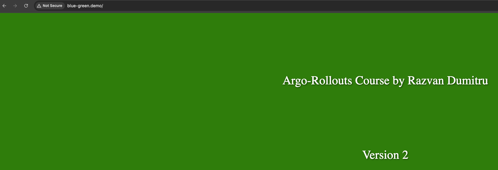
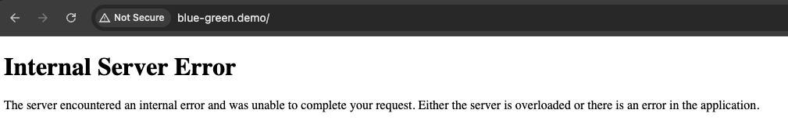
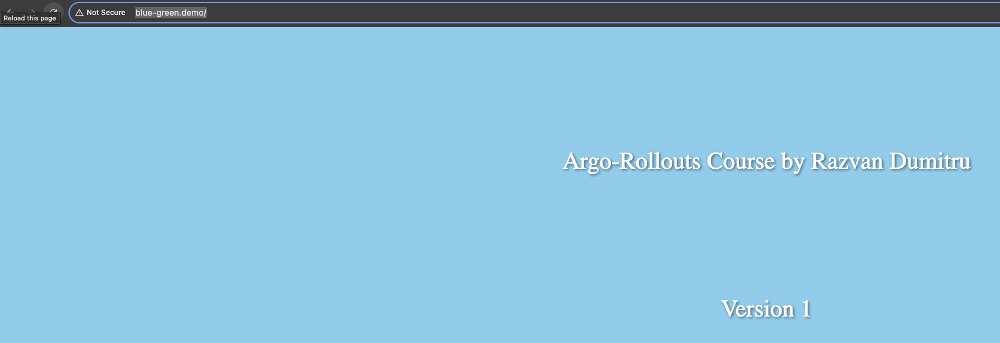
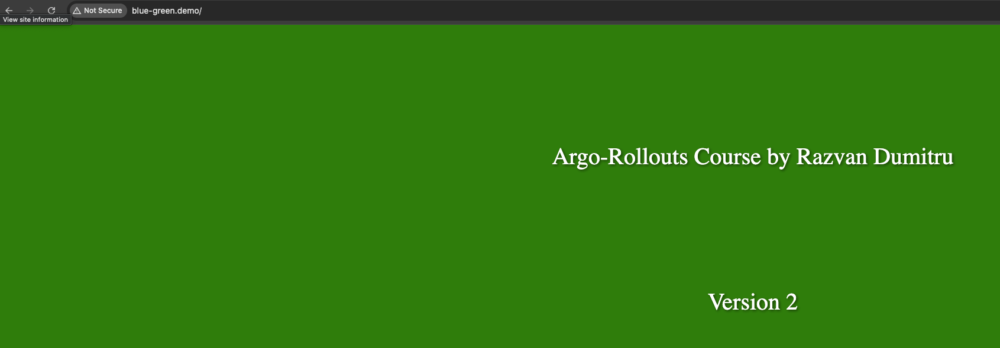
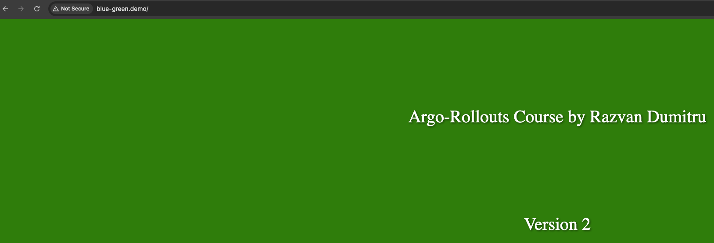
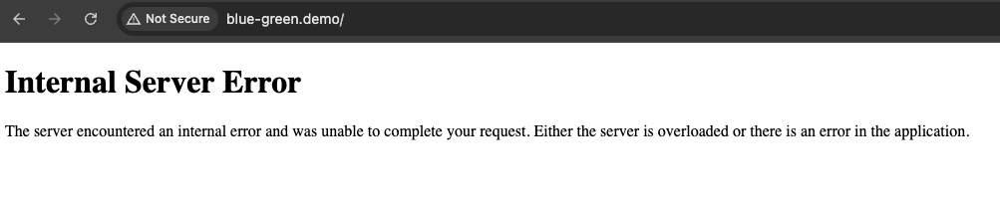

## Analysis in Argo Rollouts

 

We can analyze our applications, we can define some metrics to check the health status of the application, and if everything is good we can switch to the new version of the application completely.
 

It's possible to analyze the application in **canary deployment strategy** as well as **blue-green deployment strategy**.

 

In this section we have 3 important CRD's.
 

- AnalysysTemplate
  - Is a template spec which defines how to perform an analysis such as the metrics which it should perform it frequency and the values which are considered successful or failed.
    (I'm going to measure the success rate of the application and if the result is 80% or more, the analysis will be successful, otherwise it will fail.)
- ClusterAnalysisTemplate
  - Is like an AnalysisTemplate but is not limited to it's namespace, it can be used by any rollout throughout the cluster.
- AnalysisRun
  - Is an instantiation of an AnalysisTemplate
  - Ary like jobs in that they eventually complete.
  - Completed runs are considered successful or failed.
  - The result of the run affect if the rollout update will continue, abort or pause respectively.

### Analysis with blue-green deployments

 

It's possible to use analysis and blue-green deployment strategy before and after the promotion.
 

- Pre-promotion
  - A Rollout using the blue-green strategy can launch an analysis run before it switches traffic to the new version using pre-promotion.
  - This can be used to block the Service selector switch until the analysis run finishes successfully.
  - The success or failure of the analysis run decides if the Rollout switches traffic or abort the Rollout completely.
- Post-promotion
  - A Rollout using a blue-green strategy can launch an analysis run after the traffic switch to the new version using post-promotion analysis.
  - If it fails or errors the Rollout enters an aborted state and switches traffic back to the previous stable replicaset.
  - If it's successful the Rollout is considered fully promoted and the new replicaset will be marked as stable. The old replicaset will then be scaled down according to **scaleDownDelaySeconds** and it's default is 30 seconds.

 

### Pre-promotion

 
**14-argocd-rollouts/blue-green-analysis/rollout-with-analysis.yml**
 

    apiVersion: argoproj.io/v1alpha1
    kind: Rollout
    metadata:
      name: blue-green-deployment
    spec:
      replicas: 4
      selector:
        matchLabels:
          app: blue-green-deployment
      template:
        metadata:
          labels:
            app: blue-green-deployment
        spec:
          containers:
          - name: blue-green
            image: micutzu/blue-green
            imagePullPolicy: Never
            env:
            - name: html_name
              value: "app-v1.html"
            ports:
            - containerPort: 5000
      strategy:
        blueGreen: 
          activeService: rollout-bluegreen-active
          previewService: rollout-bluegreen-preview
          autoPromotionEnabled: true
          # prePromotionAnalysis:     #### Pre-Promotion Analysis
          #   templates:
          #   - templateName: success-rate-pre
          #   args:
          #   - name: service-namespace
          #     value: blue-green
          # postPromotionAnalysis:    #### Post-Promotion Analysis
          #  templates:
          #  - templateName: success-rate-post
          #  args:
          #  - name: service-namespace
          #    value: blue-green
          # abortScaleDownDelaySeconds: 10
          # scaleDownDelaySeconds: 60
          # previewReplicaCount: 2
          # autoPromotionSeconds: 70
    ---
    kind: Service
    apiVersion: v1
    metadata:
      name: rollout-bluegreen-active
    spec:
      selector:
        app: blue-green-deployment
      ports:
      - protocol: TCP
        port: 5000
        targetPort: 5000

    ---
    kind: Service
    apiVersion: v1
    metadata:
      name: rollout-bluegreen-preview
    spec:
      selector:
        app: blue-green-deployment
      ports:
      - protocol: TCP
        port: 5000
        targetPort: 5000

 

**14-argocd-rollouts/blue-green-analysis/ingress.yml**
 

    apiVersion: networking.k8s.io/v1
    kind: Ingress
    metadata:
      name: blue-green-ingress
    spec:
      ingressClassName: nginx
      rules:
      - host: blue-green.demo
        http:
          paths:
          - path: /
            pathType: Prefix
            backend:
              service:
                name: rollout-bluegreen-active
                port:
                  number: 5000

    kubectl apply -f rollout-with-analysis.yml
    kubectl apply -f ingress.yml
    kubectl argo rollouts get rollouts blue-green-deployment
      Name:            blue-green-deployment
      Namespace:       default
      Status:          ✔ Healthy
      Strategy:        BlueGreen
      Images:          micutzu/blue-green (stable, active)
      Replicas:
        Desired:       4
        Current:       4
        Updated:       4
        Ready:         4
        Available:     4

      NAME                                               KIND        STATUS     AGE  INFO
      ⟳ blue-green-deployment                            Rollout     ✔ Healthy  15s
      └──# revision:1
         └──⧉ blue-green-deployment-57b948686d           ReplicaSet  ✔ Healthy  15s  stable,active
            ├──□ blue-green-deployment-57b948686d-jnqsv  Pod         ✔ Running  15s  ready:1/1
            ├──□ blue-green-deployment-57b948686d-kv4k2  Pod         ✔ Running  15s  ready:1/1
            ├──□ blue-green-deployment-57b948686d-tn8fj  Pod         ✔ Running  15s  ready:1/1
            └──□ blue-green-deployment-57b948686d-vr7bj  Pod         ✔ Running  15s  ready:1/1

 

Accessing the host **http://blue-green.demo/** configured in **14-argocd-rollouts/blue-green-analysis/ingress.yml** you will see the version 1 of the application.
 

 

Now modifying the environment variable value from **app-v1.html** to **app-v2.html** it will automatically get promoted because of the **autoPromotionEnabled: true** option.
 

    kubectl apply -f rollout-with-analysis.yml
      rollout.argoproj.io/blue-green-deployment configured
      service/rollout-bluegreen-active unchanged
      service/rollout-bluegreen-preview unchanged

    kubectl argo rollouts get rollouts blue-green-deployment
      Name:            blue-green-deployment
      Namespace:       default
      Status:          ✔ Healthy
      Strategy:        BlueGreen
      Images:          micutzu/blue-green (stable, active)
      Replicas:
        Desired:       4
        Current:       4
        Updated:       4
        Ready:         4
        Available:     4

      NAME                                               KIND        STATUS         AGE   INFO
      ⟳ blue-green-deployment                            Rollout     ✔ Healthy      8m5s
      ├──# revision:2
      │  └──⧉ blue-green-deployment-6979d5dbdc           ReplicaSet  ✔ Healthy      45s   stable,active
      │     ├──□ blue-green-deployment-6979d5dbdc-4wwcp  Pod         ✔ Running      45s   ready:1/1
      │     ├──□ blue-green-deployment-6979d5dbdc-7ft9x  Pod         ✔ Running      45s   ready:1/1
      │     ├──□ blue-green-deployment-6979d5dbdc-dgtfr  Pod         ✔ Running      45s   ready:1/1
      │     └──□ blue-green-deployment-6979d5dbdc-vkcdc  Pod         ✔ Running      45s   ready:1/1
      └──# revision:1
         └──⧉ blue-green-deployment-57b948686d           ReplicaSet  • ScaledDown   8m5s
            ├──□ blue-green-deployment-57b948686d-jnqsv  Pod         ◌ Terminating  8m5s  ready:1/1
            ├──□ blue-green-deployment-57b948686d-kv4k2  Pod         ◌ Terminating  8m5s  ready:1/1
            ├──□ blue-green-deployment-57b948686d-tn8fj  Pod         ◌ Terminating  8m5s  ready:1/1
            └──□ blue-green-deployment-57b948686d-vr7bj  Pod         ◌ Terminating  8m5s  ready:1/1

 

Checking again the **http://blue-green.demo/** url we will see that the application got promoted to version 2
 

 

Now if I change the environment variable value from **app-v2.html** to a invalid value, let's say **app-v3.html** and apply the yaml file, when we refresh the **http://blue-green.demo/** page we will get an error.
 

    kubectl apply -f rollout-with-analysis.yml
      rollout.argoproj.io/blue-green-deployment configured
      service/rollout-bluegreen-active unchanged
      service/rollout-bluegreen-preview unchanged

 

This time I will use the **pre-promotion analysis** to check the health status of the **preview service**, because the **preview service** always points to the new version of the application, to the new replicaset.
 

I'm going to use it before switching to the new version of the application.
 

Delete the deployed rollout.
 

    kubectl delete -f rollout-with-analysis.yml

We have multiple providers in argo rollouts analysis to define some metrics for the analyzing purposes.
 

One of this providers is the kubernetes job object.
 

We can use jobs to define some metrics if the result of the job is successful the rollout will continue and we will switch to the new version of the application, and if the result of the job is failure, the rollout will be aborted and we will back to the previous version of the application.

 

**14-argocd-rollouts/blue-green-analysis/app-success-rate.sh** is a shell script that is responsible to measure the success rate of the **preview service** or **active service**
 

In the next example we will use **pre-promotion analysis** so I'm going to measure the success rate for the **preview service**.
 

We uncommented the **strategy.blueGreen.prePromotionAnalysis**
 

Here is the **14-argocd-rollouts/blue-green-analysis/rollout-with-analysis.yml** file.
 

    apiVersion: argoproj.io/v1alpha1
    kind: Rollout
    metadata:
      name: blue-green-deployment
    spec:
      replicas: 4
      selector:
        matchLabels:
          app: blue-green-deployment
      template:
        metadata:
          labels:
            app: blue-green-deployment
        spec:
          containers:
          - name: blue-green
            image: micutzu/blue-green
            env:
            - name: html_name
              value: "app-v3.html"
            ports:
            - containerPort: 5000
      strategy:
        blueGreen: 
          activeService: rollout-bluegreen-active
          previewService: rollout-bluegreen-preview
          autoPromotionEnabled: true
          prePromotionAnalysis:     #### Pre-Promotion Analysis
            templates:
            - templateName: success-rate-pre
          # postPromotionAnalysis:    #### Post-Promotion Analysis
          #  templates:
          #  - templateName: success-rate-post
          #  args:
          #  - name: service-namespace
          #    value: blue-green
          # abortScaleDownDelaySeconds: 10
          # scaleDownDelaySeconds: 60
          # previewReplicaCount: 2
          # autoPromotionSeconds: 70
    ---
    kind: Service
    apiVersion: v1
    metadata:
      name: rollout-bluegreen-active
    spec:
      selector:
        app: blue-green-deployment
      ports:
      - protocol: TCP
        port: 5000
        targetPort: 5000

    ---
    kind: Service
    apiVersion: v1
    metadata:
      name: rollout-bluegreen-preview
    spec:
      selector:
        app: blue-green-deployment
      ports:
      - protocol: TCP
        port: 5000
        targetPort: 5000

Change **"app-v3.html"** to **"app-v1.html"**
 

**14-argocd-rollouts/blue-green-analysis/pre-promotion-analysis.yml**
 

    apiVersion: argoproj.io/v1alpha1
    kind: AnalysisTemplate
    metadata:
      name: success-rate-pre ######## pre-promotion-analysis
    spec:
      metrics:
      - name: success-rate-pre
        provider:
          job:
            metadata:
              labels:
                analysis: pre-promotion # labels defined here will be copied to the Job object
            spec:
              backoffLimit: 0
              template:
                spec:
                  containers:
                  - name: success-rate-pre
                    image: micutzu/analysis ##### this is the same image that we built to get success_rate . you can find related files (Dockerfile, app-success-rate.sh) in the current directory
                    env:
                    - name: service_url
                      value: "http://rollout-bluegreen-preview.default.svc.cluster.local:5000"
                      # value: "http://rollout-bluegreen-preview.{{args.service-namespace}}.svc.cluster.local:{{args.service-port}}"
                    command: ["/bin/bash", "-c"]
                    args:
                    - ./app-success-rate.sh
                  restartPolicy: Never

 
**strategy.blueGreen.prePromotionAnalysis.templates.templateName** is the **metadata.name** from **14-argocd-rollouts/blue-green-analysis/pre-promotion-analysis.yml**
 

    kubectl apply -f pre-promotion-analysis.yml
    kubectl apply -f rollout-with-analysis.yml
    kubectl argo rollouts get rollouts blue-green-deployment
      Name:            blue-green-deployment
      Namespace:       default
      Status:          ✔ Healthy
      Strategy:        BlueGreen
      Images:          micutzu/blue-green (stable, active)
      Replicas:
        Desired:       4
        Current:       4
        Updated:       4
        Ready:         4
        Available:     4

      NAME                                               KIND        STATUS     AGE  INFO
      ⟳ blue-green-deployment                            Rollout     ✔ Healthy  22s
      └──# revision:1
         └──⧉ blue-green-deployment-57b948686d           ReplicaSet  ✔ Healthy  22s  stable,active
            ├──□ blue-green-deployment-57b948686d-jkk5r  Pod         ✔ Running  22s  ready:1/1
            ├──□ blue-green-deployment-57b948686d-lqdwj  Pod         ✔ Running  22s  ready:1/1
            ├──□ blue-green-deployment-57b948686d-m57m6  Pod         ✔ Running  22s  ready:1/1
            └──□ blue-green-deployment-57b948686d-rt48b  Pod         ✔ Running  22s  ready:1/1

Access **http://blue-green.demo/**
 

 

I change **"app-v1.html"** to **"app-v2.html"** Argo Rollouts will create a new replicaset but it will not switch to the new version of the application because of the **prePromotionAnalysis** field.
 
So it will first analyze our application before switching to the new version of the application using this template **14-argocd-rollouts/blue-green-analysis/pre-promotion-analysis.yml**.
 

    kubectl apply -f rollout-with-analysis.yml
    kubectl argo rollouts get rollouts blue-green-deployment
      Name:            blue-green-deployment
      Namespace:       default
      Status:          ◌ Progressing
      Message:         active service cutover pending
      Strategy:        BlueGreen
      Images:          micutzu/blue-green (active, preview, stable)
      Replicas:
        Desired:       4
        Current:       8
        Updated:       4
        Ready:         4
        Available:     4

      NAME                                                                KIND         STATUS         AGE    INFO
      ⟳ blue-green-deployment                                             Rollout      ◌ Progressing  5m22s
      ├──# revision:2
      │  ├──⧉ blue-green-deployment-6979d5dbdc                            ReplicaSet   ✔ Healthy      10s    preview
      │  │  ├──□ blue-green-deployment-6979d5dbdc-2njc5                   Pod          ✔ Running      10s    ready:1/1
      │  │  ├──□ blue-green-deployment-6979d5dbdc-526qs                   Pod          ✔ Running      10s    ready:1/1
      │  │  ├──□ blue-green-deployment-6979d5dbdc-nr4x5                   Pod          ✔ Running      10s    ready:1/1
      │  │  └──□ blue-green-deployment-6979d5dbdc-p9gxc                   Pod          ✔ Running      10s    ready:1/1
      │  └──α blue-green-deployment-6979d5dbdc-2-pre                      AnalysisRun  ◌ Running      5s
      │     └──⊞ 2408dd85-10dd-41ec-8bb9-79a1b04d4537.success-rate-pre.1  Job          ◌ Running      5s
      └──# revision:1
         └──⧉ blue-green-deployment-57b948686d                            ReplicaSet   ✔ Healthy      5m22s  stable,active
            ├──□ blue-green-deployment-57b948686d-8zxfm                   Pod          ✔ Running      5m22s  ready:1/1
            ├──□ blue-green-deployment-57b948686d-ngrg7                   Pod          ✔ Running      5m22s  ready:1/1
            ├──□ blue-green-deployment-57b948686d-sp2f8                   Pod          ✔ Running      5m22s  ready:1/1
            └──□ blue-green-deployment-57b948686d-vh7fd                   Pod          ✔ Running      5m22s  ready:1/1

    kubectl argo rollouts get rollouts blue-green-deployment
      Name:            blue-green-deployment
      Namespace:       default
      Status:          ✔ Healthy
      Strategy:        BlueGreen
      Images:          micutzu/blue-green (stable, active)
      Replicas:
        Desired:       4
        Current:       4
        Updated:       4
        Ready:         4
        Available:     4

      NAME                                                                KIND         STATUS        AGE    INFO
      ⟳ blue-green-deployment                                             Rollout      ✔ Healthy     6m57s
      ├──# revision:2
      │  ├──⧉ blue-green-deployment-6979d5dbdc                            ReplicaSet   ✔ Healthy     105s   stable,active
      │  │  ├──□ blue-green-deployment-6979d5dbdc-2njc5                   Pod          ✔ Running     105s   ready:1/1
      │  │  ├──□ blue-green-deployment-6979d5dbdc-526qs                   Pod          ✔ Running     105s   ready:1/1
      │  │  ├──□ blue-green-deployment-6979d5dbdc-nr4x5                   Pod          ✔ Running     105s   ready:1/1
      │  │  └──□ blue-green-deployment-6979d5dbdc-p9gxc                   Pod          ✔ Running     105s   ready:1/1
      │  └──α blue-green-deployment-6979d5dbdc-2-pre                      AnalysisRun  ✔ Successful  100s   ✔ 1
      │     └──⊞ 2408dd85-10dd-41ec-8bb9-79a1b04d4537.success-rate-pre.1  Job          ✔ Successful  100s
      └──# revision:1
         └──⧉ blue-green-deployment-57b948686d                            ReplicaSet   • ScaledDown  6m57s

I change **"app-v2.html"** to a invalid value **"app-v3.html"**, this time the Rollout will be aborted and we will back to the previous version of the application.
 

    kubectl apply -f rollout-with-analysis.yml
    kubectl argo rollouts get rollouts blue-green-deployment
      Name:            blue-green-deployment
      Namespace:       default
      Status:          ◌ Progressing
      Message:         active service cutover pending
      Strategy:        BlueGreen
      Images:          micutzu/blue-green (active, preview, stable)
      Replicas:
        Desired:       4
        Current:       8
        Updated:       4
        Ready:         4
        Available:     4

      NAME                                                                KIND         STATUS               AGE    INFO
      ⟳ blue-green-deployment                                             Rollout      ◌ Progressing        12m
      ├──# revision:3
      │  └──⧉ blue-green-deployment-66b59d6cfd                            ReplicaSet   ◌ Progressing        4s     preview
      │     ├──□ blue-green-deployment-66b59d6cfd-4skd5                   Pod          ✔ Running            4s     ready:1/1
      │     ├──□ blue-green-deployment-66b59d6cfd-9lrl2                   Pod          ◌ ContainerCreating  4s     ready:0/1
      │     ├──□ blue-green-deployment-66b59d6cfd-l6fjs                   Pod          ✔ Running            4s     ready:1/1
      │     └──□ blue-green-deployment-66b59d6cfd-n82cj                   Pod          ✔ Running            4s     ready:1/1
      ├──# revision:2
      │  ├──⧉ blue-green-deployment-6979d5dbdc                            ReplicaSet   ✔ Healthy            7m14s  stable,active
      │  │  ├──□ blue-green-deployment-6979d5dbdc-2njc5                   Pod          ✔ Running            7m14s  ready:1/1
      │  │  ├──□ blue-green-deployment-6979d5dbdc-526qs                   Pod          ✔ Running            7m14s  ready:1/1
      │  │  ├──□ blue-green-deployment-6979d5dbdc-nr4x5                   Pod          ✔ Running            7m14s  ready:1/1
      │  │  └──□ blue-green-deployment-6979d5dbdc-p9gxc                   Pod          ✔ Running            7m14s  ready:1/1
      │  └──α blue-green-deployment-6979d5dbdc-2-pre                      AnalysisRun  ✔ Successful         7m9s   ✔ 1
      │     └──⊞ 2408dd85-10dd-41ec-8bb9-79a1b04d4537.success-rate-pre.1  Job          ✔ Successful         7m9s
      └──# revision:1
         └──⧉ blue-green-deployment-57b948686d                            ReplicaSet   • ScaledDown         12m

    kubectl argo rollouts get rollouts blue-green-deployment
      Name:            blue-green-deployment
      Namespace:       default
      Status:          ✖ Degraded
      Message:         RolloutAborted: Rollout aborted update to revision 3: Metric "success-rate-pre" assessed Failed due to failed (1) > failureLimit (0)
      Strategy:        BlueGreen
      Images:          micutzu/blue-green (stable, active)
      Replicas:
        Desired:       4
        Current:       4
        Updated:       0
        Ready:         4
        Available:     4

      NAME                                                                KIND         STATUS         AGE    INFO
      ⟳ blue-green-deployment                                             Rollout      ✖ Degraded     13m
      ├──# revision:3
      │  ├──⧉ blue-green-deployment-66b59d6cfd                            ReplicaSet   • ScaledDown   74s    preview,delay:passed
      │  │  ├──□ blue-green-deployment-66b59d6cfd-4skd5                   Pod          ◌ Terminating  74s    ready:1/1
      │  │  ├──□ blue-green-deployment-66b59d6cfd-9lrl2                   Pod          ◌ Terminating  74s    ready:1/1
      │  │  ├──□ blue-green-deployment-66b59d6cfd-l6fjs                   Pod          ◌ Terminating  74s    ready:1/1
      │  │  └──□ blue-green-deployment-66b59d6cfd-n82cj                   Pod          ◌ Terminating  74s    ready:1/1
      │  └──α blue-green-deployment-66b59d6cfd-3-pre                      AnalysisRun  ✖ Failed       70s    ✖ 1
      │     └──⊞ 3c8c8493-00c3-449a-9e82-5b718307f7a7.success-rate-pre.1  Job          ✖ Failed       70s
      ├──# revision:2
      │  ├──⧉ blue-green-deployment-6979d5dbdc                            ReplicaSet   ✔ Healthy      8m24s  stable,active
      │  │  ├──□ blue-green-deployment-6979d5dbdc-2njc5                   Pod          ✔ Running      8m24s  ready:1/1
      │  │  ├──□ blue-green-deployment-6979d5dbdc-526qs                   Pod          ✔ Running      8m24s  ready:1/1
      │  │  ├──□ blue-green-deployment-6979d5dbdc-nr4x5                   Pod          ✔ Running      8m24s  ready:1/1
      │  │  └──□ blue-green-deployment-6979d5dbdc-p9gxc                   Pod          ✔ Running      8m24s  ready:1/1
      │  └──α blue-green-deployment-6979d5dbdc-2-pre                      AnalysisRun  ✔ Successful   8m19s  ✔ 1
      │     └──⊞ 2408dd85-10dd-41ec-8bb9-79a1b04d4537.success-rate-pre.1  Job          ✔ Successful   8m19s
      └──# revision:1
         └──⧉ blue-green-deployment-57b948686d                            ReplicaSet   • ScaledDown   13m

    kubectl argo rollouts get rollouts blue-green-deployment
      Name:            blue-green-deployment
      Namespace:       default
      Status:          ✖ Degraded
      Message:         RolloutAborted: Rollout aborted update to revision 3: Metric "success-rate-pre" assessed Failed due to failed (1) > failureLimit (0)
      Strategy:        BlueGreen
      Images:          micutzu/blue-green (stable, active)
      Replicas:
        Desired:       4
        Current:       4
        Updated:       0
        Ready:         4
        Available:     4

      NAME                                                                KIND         STATUS        AGE   INFO
      ⟳ blue-green-deployment                                             Rollout      ✖ Degraded    14m
      ├──# revision:3
      │  ├──⧉ blue-green-deployment-66b59d6cfd                            ReplicaSet   • ScaledDown  117s  preview,delay:passed
      │  └──α blue-green-deployment-66b59d6cfd-3-pre                      AnalysisRun  ✖ Failed      113s  ✖ 1
      │     └──⊞ 3c8c8493-00c3-449a-9e82-5b718307f7a7.success-rate-pre.1  Job          ✖ Failed      113s
      ├──# revision:2
      │  ├──⧉ blue-green-deployment-6979d5dbdc                            ReplicaSet   ✔ Healthy     9m7s  stable,active
      │  │  ├──□ blue-green-deployment-6979d5dbdc-2njc5                   Pod          ✔ Running     9m7s  ready:1/1
      │  │  ├──□ blue-green-deployment-6979d5dbdc-526qs                   Pod          ✔ Running     9m7s  ready:1/1
      │  │  ├──□ blue-green-deployment-6979d5dbdc-nr4x5                   Pod          ✔ Running     9m7s  ready:1/1
      │  │  └──□ blue-green-deployment-6979d5dbdc-p9gxc                   Pod          ✔ Running     9m7s  ready:1/1
      │  └──α blue-green-deployment-6979d5dbdc-2-pre                      AnalysisRun  ✔ Successful  9m2s  ✔ 1
      │     └──⊞ 2408dd85-10dd-41ec-8bb9-79a1b04d4537.success-rate-pre.1  Job          ✔ Successful  9m2s
      └──# revision:1
         └──⧉ blue-green-deployment-57b948686d                            ReplicaSet   • ScaledDown  14m

    kubectl delete -f rollout-with-analysis.yml
    kubectl delete -f pre-promotion-analysis.yml

### Post-promotion
 

I change back **"app-v3.html"** to **"app-v1.html"** in **14-argocd-rollouts/blue-green-analysis/rollout-with-analysis.yml**
 

**14-argocd-rollouts/blue-green-analysis/post-promotion-analysis.yml**
 

    apiVersion: argoproj.io/v1alpha1
    kind: AnalysisTemplate
    metadata:
      name: success-rate-post ######## post-promotion-analysis
    spec:
      metrics:
      - name: success-rate-post
        provider:
          job:
            metadata:
              labels:
                analysis: post-promotion # labels defined here will be copied to the Job object
            spec:
              backoffLimit: 0
              template:
                spec:
                  containers:
                  - name: success-rate-post
                    image: analysis
                    imagePullPolicy: Never
                    env:
                    - name: service_url
                      value: "http://rollout-bluegreen-active.{{args.service-namespace}}.svc.cluster.local:{{args.service-port}}"
                    command: ["/bin/bash", "-c"]
                    args:
                    - ./app-success-rate.sh
                  restartPolicy: Never

**14-argocd-rollouts/blue-green-analysis/rollout-with-analysis.yml**
 

    apiVersion: argoproj.io/v1alpha1
    kind: Rollout
    metadata:
      name: blue-green-deployment
    spec:
      replicas: 4
      selector:
        matchLabels:
          app: blue-green-deployment
      template:
        metadata:
          labels:
            app: blue-green-deployment
        spec:
          containers:
          - name: blue-green
            image: micutzu/blue-green
            env:
            - name: html_name
              value: "app-v1.html"
            ports:
            - containerPort: 5000
      strategy:
        blueGreen: 
          activeService: rollout-bluegreen-active
          previewService: rollout-bluegreen-preview
          autoPromotionEnabled: true
          # prePromotionAnalysis:     #### Pre-Promotion Analysis
          #   templates:
          #     - templateName: success-rate-pre
          postPromotionAnalysis:    #### Post-Promotion Analysis
            templates:
            - templateName: success-rate-post
          #  args:
          #  - name: service-namespace
          #    value: blue-green
          # abortScaleDownDelaySeconds: 10
          # scaleDownDelaySeconds: 60
          # previewReplicaCount: 2
          # autoPromotionSeconds: 70
    ---
    kind: Service
    apiVersion: v1
    metadata:
      name: rollout-bluegreen-active
    spec:
      selector:
        app: blue-green-deployment
      ports:
      - protocol: TCP
        port: 5000
        targetPort: 5000

    ---
    kind: Service
    apiVersion: v1
    metadata:
      name: rollout-bluegreen-preview
    spec:
      selector:
        app: blue-green-deployment
      ports:
      - protocol: TCP
        port: 5000
        targetPort: 5000

    kubectl apply -f post-promotion-analysis.yml
    kubectl apply -f rollout-with-analysis.yml

    kubectl argo rollouts get rollouts blue-green-deployment
      Name:            blue-green-deployment
      Namespace:       default
      Status:          ✔ Healthy
      Strategy:        BlueGreen
      Images:          micutzu/blue-green (stable, active)
      Replicas:
        Desired:       4
        Current:       4
        Updated:       4
        Ready:         4
        Available:     4

      NAME                                               KIND        STATUS     AGE  INFO
      ⟳ blue-green-deployment                            Rollout     ✔ Healthy  9s
      └──# revision:1
         └──⧉ blue-green-deployment-57b948686d           ReplicaSet  ✔ Healthy  9s   stable,active
            ├──□ blue-green-deployment-57b948686d-ccwnn  Pod         ✔ Running  9s   ready:1/1
            ├──□ blue-green-deployment-57b948686d-d92q9  Pod         ✔ Running  9s   ready:1/1
            ├──□ blue-green-deployment-57b948686d-gpwj5  Pod         ✔ Running  9s   ready:1/1
            └──□ blue-green-deployment-57b948686d-pk45k  Pod         ✔ Running  9s   ready:1/1

Access **http://blue-green.demo/**
 

 

Now when I change **"app-v1.html"** to **"app-v2.html"** Argo Rollouts will create a new replicaset and switch the traffic to the new version because **autoPromotionEnabled: true** is set, and then it will run an analysis run with this **14-argocd-rollouts/blue-green-analysis/post-promotion-analysis.yml** template, and if everything is good the new replicaset will be marked as table and if not we will back to the previous version.
 

    kubectl apply -f rollout-with-analysis.yml
    kubectl argo rollouts get rollouts blue-green-deployment
      Name:            blue-green-deployment
      Namespace:       default
      Status:          ✔ Healthy
      Strategy:        BlueGreen
      Images:          micutzu/blue-green (active, stable)
      Replicas:
        Desired:       4
        Current:       8
        Updated:       4
        Ready:         4
        Available:     4

      NAME                                                                 KIND         STATUS        AGE  INFO
      ⟳ blue-green-deployment                                              Rollout      ✔ Healthy     80s
      ├──# revision:2
      │  ├──⧉ blue-green-deployment-6979d5dbdc                             ReplicaSet   ✔ Healthy     49s  stable,active
      │  │  ├──□ blue-green-deployment-6979d5dbdc-2v59k                    Pod          ✔ Running     49s  ready:1/1
      │  │  ├──□ blue-green-deployment-6979d5dbdc-9jxnb                    Pod          ✔ Running     49s  ready:1/1
      │  │  ├──□ blue-green-deployment-6979d5dbdc-p5fxr                    Pod          ✔ Running     49s  ready:1/1
      │  │  └──□ blue-green-deployment-6979d5dbdc-xq7k6                    Pod          ✔ Running     49s  ready:1/1
      │  └──α blue-green-deployment-6979d5dbdc-2-post                      AnalysisRun  ✔ Successful  44s  ✔ 1
      │     └──⊞ bb97d2d2-d7d5-4ba6-8743-0333a15fbd4a.success-rate-post.1  Job          ✔ Successful  44s
      └──# revision:1
         └──⧉ blue-green-deployment-57b948686d                             ReplicaSet   ✔ Healthy     80s  delay:15s
            ├──□ blue-green-deployment-57b948686d-4wdmx                    Pod          ✔ Running     80s  ready:1/1
            ├──□ blue-green-deployment-57b948686d-n7t6v                    Pod          ✔ Running     80s  ready:1/1
            ├──□ blue-green-deployment-57b948686d-qdk5t                    Pod          ✔ Running     80s  ready:1/1
            └──□ blue-green-deployment-57b948686d-sqbrb                    Pod          ✔ Running     80s  ready:1/1

    kubectl argo rollouts get rollouts blue-green-deployment
      Name:            blue-green-deployment
      Namespace:       default
      Status:          ✔ Healthy
      Strategy:        BlueGreen
      Images:          micutzu/blue-green (stable, active)
      Replicas:
        Desired:       4
        Current:       4
        Updated:       4
        Ready:         4
        Available:     4

      NAME                                                                 KIND         STATUS        AGE    INFO
      ⟳ blue-green-deployment                                              Rollout      ✔ Healthy     2m48s
      ├──# revision:2
      │  ├──⧉ blue-green-deployment-6979d5dbdc                             ReplicaSet   ✔ Healthy     2m17s  stable,active
      │  │  ├──□ blue-green-deployment-6979d5dbdc-2v59k                    Pod          ✔ Running     2m17s  ready:1/1
      │  │  ├──□ blue-green-deployment-6979d5dbdc-9jxnb                    Pod          ✔ Running     2m17s  ready:1/1
      │  │  ├──□ blue-green-deployment-6979d5dbdc-p5fxr                    Pod          ✔ Running     2m17s  ready:1/1
      │  │  └──□ blue-green-deployment-6979d5dbdc-xq7k6                    Pod          ✔ Running     2m17s  ready:1/1
      │  └──α blue-green-deployment-6979d5dbdc-2-post                      AnalysisRun  ✔ Successful  2m12s  ✔ 1
      │     └──⊞ bb97d2d2-d7d5-4ba6-8743-0333a15fbd4a.success-rate-post.1  Job          ✔ Successful  2m12s
      └──# revision:1
         └──⧉ blue-green-deployment-57b948686d                             ReplicaSet   • ScaledDown  2m48s

 

Now when I change **"app-v2.html"** to a invalid value **"app-v3.html"**, the new replicaset will be created and **active service** points to this revision, but the result of analysis will be failed because of that, and the Rollout will be aborted and we will back to the previous version.
 

    k apply -f rollout-with-analysis.yml
    kubectl argo rollouts get rollouts blue-green-deployment
      Name:            blue-green-deployment
      Namespace:       default
      Status:          ◌ Progressing
      Message:         waiting for analysis to complete
      Strategy:        BlueGreen
      Images:          micutzu/blue-green (active, stable)
      Replicas:
        Desired:       4
        Current:       8
        Updated:       4
        Ready:         4
        Available:     4

      NAME                                                                 KIND         STATUS         AGE    INFO
      ⟳ blue-green-deployment                                              Rollout      ◌ Progressing  8m10s
      ├──# revision:3
      │  ├──⧉ blue-green-deployment-66b59d6cfd                             ReplicaSet   ✔ Healthy      16s    active
      │  │  ├──□ blue-green-deployment-66b59d6cfd-9nhpq                    Pod          ✔ Running      16s    ready:1/1
      │  │  ├──□ blue-green-deployment-66b59d6cfd-bkzbp                    Pod          ✔ Running      16s    ready:1/1
      │  │  ├──□ blue-green-deployment-66b59d6cfd-l5bsf                    Pod          ✔ Running      16s    ready:1/1
      │  │  └──□ blue-green-deployment-66b59d6cfd-ptz5b                    Pod          ✔ Running      16s    ready:1/1
      │  └──α blue-green-deployment-66b59d6cfd-3-post                      AnalysisRun  ◌ Running      11s
      │     └──⊞ 70be78e4-ec1a-45f1-9c68-ffa3f776b1c1.success-rate-post.1  Job          ◌ Running      11s
      ├──# revision:2
      │  ├──⧉ blue-green-deployment-6979d5dbdc                             ReplicaSet   ✔ Healthy      7m39s  stable
      │  │  ├──□ blue-green-deployment-6979d5dbdc-2v59k                    Pod          ✔ Running      7m39s  ready:1/1
      │  │  ├──□ blue-green-deployment-6979d5dbdc-9jxnb                    Pod          ✔ Running      7m39s  ready:1/1
      │  │  ├──□ blue-green-deployment-6979d5dbdc-p5fxr                    Pod          ✔ Running      7m39s  ready:1/1
      │  │  └──□ blue-green-deployment-6979d5dbdc-xq7k6                    Pod          ✔ Running      7m39s  ready:1/1
      │  └──α blue-green-deployment-6979d5dbdc-2-post                      AnalysisRun  ✔ Successful   7m34s  ✔ 1
      │     └──⊞ bb97d2d2-d7d5-4ba6-8743-0333a15fbd4a.success-rate-post.1  Job          ✔ Successful   7m34s
      └──# revision:1
         └──⧉ blue-green-deployment-57b948686d                             ReplicaSet   • ScaledDown   8m10s

 

    kubectl argo rollouts get rollouts blue-green-deployment
      Name:            blue-green-deployment
      Namespace:       default
      Status:          ✖ Degraded
      Message:         RolloutAborted: Rollout aborted update to revision 3: Metric "success-rate-post" assessed Failed due to failed (1) > failureLimit (0)
      Strategy:        BlueGreen
      Images:          micutzu/blue-green (stable, active)
      Replicas:
        Desired:       4
        Current:       4
        Updated:       0
        Ready:         4
        Available:     4

      NAME                                                                 KIND         STATUS        AGE    INFO
      ⟳ blue-green-deployment                                              Rollout      ✖ Degraded    10m
      ├──# revision:3
      │  ├──⧉ blue-green-deployment-66b59d6cfd                             ReplicaSet   • ScaledDown  2m19s  preview,delay:passed
      │  └──α blue-green-deployment-66b59d6cfd-3-post                      AnalysisRun  ✖ Failed      2m14s  ✖ 1
      │     └──⊞ 70be78e4-ec1a-45f1-9c68-ffa3f776b1c1.success-rate-post.1  Job          ✖ Failed      2m14s
      ├──# revision:2
      │  ├──⧉ blue-green-deployment-6979d5dbdc                             ReplicaSet   ✔ Healthy     9m42s  stable,active
      │  │  ├──□ blue-green-deployment-6979d5dbdc-2v59k                    Pod          ✔ Running     9m42s  ready:1/1
      │  │  ├──□ blue-green-deployment-6979d5dbdc-9jxnb                    Pod          ✔ Running     9m42s  ready:1/1
      │  │  ├──□ blue-green-deployment-6979d5dbdc-p5fxr                    Pod          ✔ Running     9m42s  ready:1/1
      │  │  └──□ blue-green-deployment-6979d5dbdc-xq7k6                    Pod          ✔ Running     9m42s  ready:1/1
      │  └──α blue-green-deployment-6979d5dbdc-2-post                      AnalysisRun  ✔ Successful  9m37s  ✔ 1
      │     └──⊞ bb97d2d2-d7d5-4ba6-8743-0333a15fbd4a.success-rate-post.1  Job          ✔ Successful  9m37s
      └──# revision:1
         └──⧉ blue-green-deployment-57b948686d                             ReplicaSet   • ScaledDown  10m

 

### Analysis Template Arguments
 
Analysis Template may declare a set of arguments that can be passed by Rollouts. The arguments can then be used as in metric configuration and are resolved at the time that Analysis run is created.
 

In **14-argocd-rollouts/blue-green-analysis/post-promotion-analysis.yml** we added the **args** block with 2 arguments:
- service-port with the value of 5000
- service-namespace with no value
  - Because it has no value in **14-argocd-rollouts/blue-green-analysis/rollout-with-analysis.yml** we need to add **args** block and specify the name and value for it.

 

In **14-argocd-rollouts/blue-green-analysis/rollout-with-analysis.yml** I added the **args** block under **strategy.blueGreen.postPromotionAnalysis.args**.
 

    kubectl delete -f rollout-with-analysis.yml

Now change **"app-v3.html"** back to **"app-v1.html"** and apply it again.
 

    kubectl apply -f rollout-with-analysis.yml
    kubectl argo rollouts get rollouts blue-green-deployment
      Name:            blue-green-deployment
      Namespace:       default
      Status:          ✔ Healthy
      Strategy:        BlueGreen
      Images:          micutzu/blue-green (stable, active)
      Replicas:
        Desired:       4
        Current:       4
        Updated:       4
        Ready:         4
        Available:     4

      NAME                                               KIND        STATUS     AGE  INFO
      ⟳ blue-green-deployment                            Rollout     ✔ Healthy  19s
      └──# revision:1
         └──⧉ blue-green-deployment-57b948686d           ReplicaSet  ✔ Healthy  19s  stable,active
            ├──□ blue-green-deployment-57b948686d-925w5  Pod         ✔ Running  19s  ready:1/1
            ├──□ blue-green-deployment-57b948686d-9km9f  Pod         ✔ Running  19s  ready:1/1
            ├──□ blue-green-deployment-57b948686d-fd9p8  Pod         ✔ Running  19s  ready:1/1
            └──□ blue-green-deployment-57b948686d-prmk8  Pod         ✔ Running  19s  ready:1/1

    kubectl delete -f rollout-with-analysis.yml
    kubectl delete -f post-promotion-analysis.yml
    kubectl delete -f ingress.yml

### Analysis with canary deployments
 

For the canary strategy we will use **web provider** instead of **job provider**.
 

The **web provider** makes a request (GET|POST|PUT) to a url and that url must return json content.
 

{
  "data":
  {
    "ok": true
  }
}

 

In this provider we have 2 different conditions **successCondition** and **failureCondition**. We can use one of them in this provider.
 

For example this Analysis will be successful if successCondition: .data.ok == true
The Analysis will fail if failureCondition: .data.ok: == false 
 

**14-argocd-rollouts/canary-analysis/rollout-with-analysis.yml**
 

    apiVersion: argoproj.io/v1alpha1
    kind: Rollout
    metadata:
      name: rollouts-setweight
    spec:
      replicas: 5
      strategy:
        canary:
        # analysis:      #### This is a Backgound Analysis
        #    templates:
        #    - templateName: success-rate
        #    args:
        #      - name: service_port #### This is the variable related to the port of analysis-app.py flask app
        #        value: "5001"
          steps:
          - setWeight: 20
          - pause: {}
          - setWeight: 40
          - pause: {duration: 10s}
          # - analysis: #### This is an Inline Analysis
          #     templates:
          #     - templateName: success-rate
          #     args:
          #     - name: service_port #### This is the variable related to the port of analysis-app.py flask app
          #       value: "5001"
          - setWeight: 60
          - pause: {duration: 20s}
          - setWeight: 80
          - pause: {duration: 1m}
      selector:
        matchLabels:
          app: rollouts-setweight
      template:
        metadata:
          labels:
            app: rollouts-setweight
        spec:
          containers:
          - name: rollouts-setweight
            image: micutzu/canary # This is the same image that we built in blue-green session , I just re-tagged it
            env:
            - name: html_name
              value: "app-v1.html"
            ports:
            - containerPort: 5000
    ---
    apiVersion: v1
    kind: Service
    metadata:
      name: rollouts-setweight
    spec:
      ports:
      - port: 5000
        targetPort: 5000
      selector:
        app: rollouts-setweight

    kubectl apply -f rollout-with-analysis.yml
    kubectl argo rollouts get rollouts rollouts-setweight
      Name:            rollouts-setweight
      Namespace:       default
      Status:          ✔ Healthy
      Strategy:        Canary
        Step:          8/8
        SetWeight:     100
        ActualWeight:  100
      Images:          micutzu/canary (stable)
      Replicas:
        Desired:       5
        Current:       5
        Updated:       5
        Ready:         5
        Available:     5

      NAME                                            KIND        STATUS     AGE  INFO
      ⟳ rollouts-setweight                            Rollout     ✔ Healthy  49s
      └──# revision:1
         └──⧉ rollouts-setweight-58bd5bd9fd           ReplicaSet  ✔ Healthy  49s  stable
            ├──□ rollouts-setweight-58bd5bd9fd-fjdcc  Pod         ✔ Running  49s  ready:1/1
            ├──□ rollouts-setweight-58bd5bd9fd-mqrdw  Pod         ✔ Running  49s  ready:1/1
            ├──□ rollouts-setweight-58bd5bd9fd-qz2wv  Pod         ✔ Running  49s  ready:1/1
            ├──□ rollouts-setweight-58bd5bd9fd-vsgcq  Pod         ✔ Running  49s  ready:1/1
            └──□ rollouts-setweight-58bd5bd9fd-w44ps  Pod         ✔ Running  49s  ready:1/1

    kubectl apply -f ingress.yml

Based on the ingress manifest file, for the canary strategy we are using the **ollouts-setweight.demo** host. By accessing the host we will see version 1 of the application.
 

Because we are using the web provider we also have this **14-argocd-rollouts/canary-analysis/analysis-app.py** flask app to return a json content and in order to use the **successCondition** and **failureCondition** conditions.
 
Open a new terminal tab and run the flask application.
 

    /Users/rdumitru/Library/Python/3.11/bin/flask run --port 5001 --host 0.0.0.0
       * Debug mode: off
      WARNING: This is a development server. Do not use it in a production deployment. Use a production WSGI server instead.
       * Running on all addresses (0.0.0.0)
       * Running on http://127.0.0.1:5001
       * Running on http://192.168.1.139:5001
      Press CTRL+C to quit

    curl -X POST -H "Content-type: application/json" -d '{"url": "http://rollouts-setweight.demo"}' http://localhost:5001/measure_success_rate
      {"data":{"ok":"true"}}

Now using a invalid url
 
    curl -X POST -H "Content-type: application/json" -d '{"url": "http://rollouts-setweigh.demo"}' http://localhost:5001/measure_success_rate
      {"data":{"ok":"false"}}

We can define the AnalysisTemplate into canary strategy using 2 different ways.
- Background
  - Analysis can be run in the background while the canary is progressing through it's Rollout steps. This means that Analysis Template will not be in steps.
  - It is defined within **spec.strategy.canary**
  - It's not withinin our steps
- Inline
 

**14-argocd-rollouts/canary-analysis/canary-analysis.yml**
 

    apiVersion: argoproj.io/v1alpha1
    kind: AnalysisTemplate
    metadata:
      name: success-rate
    spec:
      args:
      - name: service_address ### This is the variable related to the ip address where the analysis-app.py is located
        value: "192.168.1.139" #### WE are using a flask script to get the url of the application and try to connect to it 5 times at 5 seconds intervals and returns one of the true or false values based on "200 response_code" in a json format, if the success_rate is 80% or more , it returns "true" value, Otherwise it returns "false" value, you can find this simple app in the current directory (its name is analysis-app.py).
      - name: service_port ### This is the variable related to the port of analysis-app.py flask app
      metrics:
      - name: success-rate
        successCondition: result == "true"
        provider:
          web:
            method: POST
            url: "http://{{args.service_address}}:{{args.service_port}}/measure_success_rate" #### The url related to the analysis-app.py flask app
            timeoutSeconds: 50 # defaults to 10 seconds
            headers:
              - key: Content-Type # if body is a json, it is recommended to set the Content-Type
                value: "application/json"
            jsonBody: # If using jsonBody Content-Type header will be automatically set to json
              url: "http://rollouts-setweight.demo"
            jsonPath: "{$.data.ok}"

Now apply **14-argocd-rollouts/canary-analysis/canary-analysis.yml** and **14-argocd-rollouts/canary-analysis/rollout-with-analysis.yml**.
 

    kubectl apply -f canary-analysis.yml
    kubectl apply -f rollout-with-analysis.yml

Now change **"app-v1.html"** to **"app-v2.html"**
 

    kubectl apply -f rollout-with-analysis.yml

Since the first step has **pause: {}** it needs to be promoted manually.
 

    kubectl argo rollouts promote rollouts-setweight
    kubectl argo rollouts get rollouts rollouts-setweight
      Name:            rollouts-setweight
      Namespace:       default
      Status:          ॥ Paused
      Message:         CanaryPauseStep
      Strategy:        Canary
        Step:          3/8
        SetWeight:     40
        ActualWeight:  40
      Images:          micutzu/canary (canary, stable)
      Replicas:
        Desired:       5
        Current:       5
        Updated:       2
        Ready:         5
        Available:     5

      NAME                                            KIND        STATUS         AGE    INFO
      ⟳ rollouts-setweight                            Rollout     ॥ Paused       116m
      ├──# revision:2
      │  └──⧉ rollouts-setweight-547ff57849           ReplicaSet  ✔ Healthy      2m32s  canary
      │     ├──□ rollouts-setweight-547ff57849-4f57z  Pod         ✔ Running      2m32s  ready:1/1
      │     └──□ rollouts-setweight-547ff57849-wzwms  Pod         ✔ Running      4s     ready:1/1
      └──# revision:1
         └──⧉ rollouts-setweight-58bd5bd9fd           ReplicaSet  ✔ Healthy      116m   stable
            ├──□ rollouts-setweight-58bd5bd9fd-fjdcc  Pod         ✔ Running      116m   ready:1/1
            ├──□ rollouts-setweight-58bd5bd9fd-mqrdw  Pod         ✔ Running      116m   ready:1/1
            ├──□ rollouts-setweight-58bd5bd9fd-qz2wv  Pod         ✔ Running      116m   ready:1/1
            └──□ rollouts-setweight-58bd5bd9fd-vsgcq  Pod         ◌ Terminating  116m   ready:1/1

    kubectl argo rollouts get rollouts rollouts-setweight
      Name:            rollouts-setweight
      Namespace:       default
      Status:          ✔ Healthy
      Strategy:        Canary
        Step:          8/8
        SetWeight:     100
        ActualWeight:  100
      Images:          micutzu/canary (stable)
      Replicas:
        Desired:       5
        Current:       5
        Updated:       5
        Ready:         5
        Available:     5

      NAME                                            KIND        STATUS         AGE    INFO
      ⟳ rollouts-setweight                            Rollout     ✔ Healthy      117m
      ├──# revision:2
      │  └──⧉ rollouts-setweight-547ff57849           ReplicaSet  ✔ Healthy      4m10s  stable
      │     ├──□ rollouts-setweight-547ff57849-4f57z  Pod         ✔ Running      4m10s  ready:1/1
      │     ├──□ rollouts-setweight-547ff57849-wzwms  Pod         ✔ Running      102s   ready:1/1
      │     ├──□ rollouts-setweight-547ff57849-dpnl2  Pod         ✔ Running      89s    ready:1/1
      │     ├──□ rollouts-setweight-547ff57849-zjh6m  Pod         ✔ Running      67s    ready:1/1
      │     └──□ rollouts-setweight-547ff57849-8zm76  Pod         ✔ Running      5s     ready:1/1
      └──# revision:1
         └──⧉ rollouts-setweight-58bd5bd9fd           ReplicaSet  • ScaledDown   117m
            └──□ rollouts-setweight-58bd5bd9fd-qz2wv  Pod         ◌ Terminating  117m   ready:1/1

    kubectl argo rollouts get rollouts rollouts-setweight
      Name:            rollouts-setweight
      Namespace:       default
      Status:          ✔ Healthy
      Strategy:        Canary
        Step:          8/8
        SetWeight:     100
        ActualWeight:  100
      Images:          micutzu/canary (stable)
      Replicas:
        Desired:       5
        Current:       5
        Updated:       5
        Ready:         5
        Available:     5
      
      NAME                                            KIND        STATUS        AGE    INFO
      ⟳ rollouts-setweight                            Rollout     ✔ Healthy     118m
      ├──# revision:2
      │  └──⧉ rollouts-setweight-547ff57849           ReplicaSet  ✔ Healthy     4m44s  stable
      │     ├──□ rollouts-setweight-547ff57849-4f57z  Pod         ✔ Running     4m44s  ready:1/1
      │     ├──□ rollouts-setweight-547ff57849-wzwms  Pod         ✔ Running     2m16s  ready:1/1
      │     ├──□ rollouts-setweight-547ff57849-dpnl2  Pod         ✔ Running     2m3s   ready:1/1
      │     ├──□ rollouts-setweight-547ff57849-zjh6m  Pod         ✔ Running     101s   ready:1/1
      │     └──□ rollouts-setweight-547ff57849-8zm76  Pod         ✔ Running     39s    ready:1/1
      └──# revision:1
         └──⧉ rollouts-setweight-58bd5bd9fd           ReplicaSet  • ScaledDown  118m

#### Background Analysis

    apiVersion: argoproj.io/v1alpha1
    kind: Rollout
    metadata:
      name: rollouts-setweight
    spec:
      replicas: 5
      strategy:
        canary:
          analysis:      #### This is a Backgound Analysis
            templates:
              - templateName: success-rate
            args:
              - name: service_port #### This is the variable related to the port of analysis-app.py flask app
                value: "5001"
          steps:
          - setWeight: 20
          - pause: {}
          - setWeight: 40
          - pause: {duration: 10s}
          # - analysis: #### This is an Inline Analysis
          #     templates:
          #     - templateName: success-rate
          #     args:
          #     - name: service_port #### This is the variable related to the port of analysis-app.py flask app
          #       value: "5001"
          - setWeight: 60
          - pause: {duration: 20s}
          - setWeight: 80
          - pause: {duration: 1m}
      selector:
        matchLabels:
          app: rollouts-setweight
      template:
        metadata:
          labels:
            app: rollouts-setweight
        spec:
          containers:
          - name: rollouts-setweight
            image: micutzu/canary # This is the same image that we built in blue-green session , I just re-tagged it
            env:
            - name: html_name
              value: "app-v1.html"
            ports:
            - containerPort: 5000
  

#### Inline Analysis